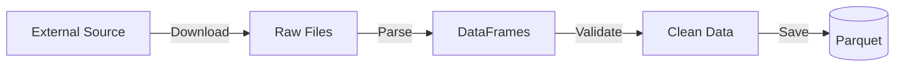
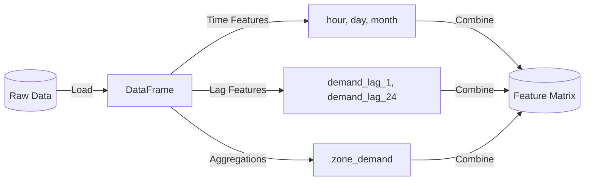
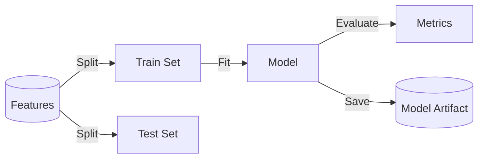
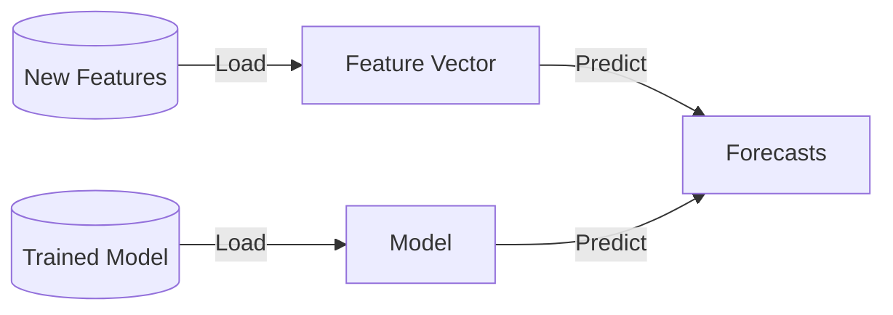
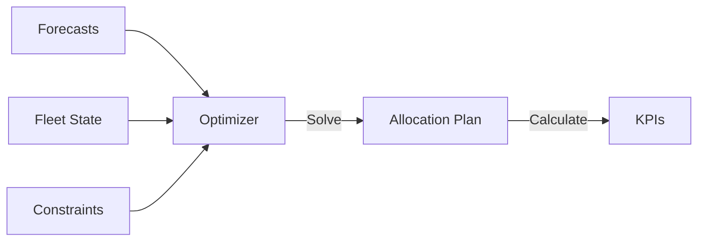
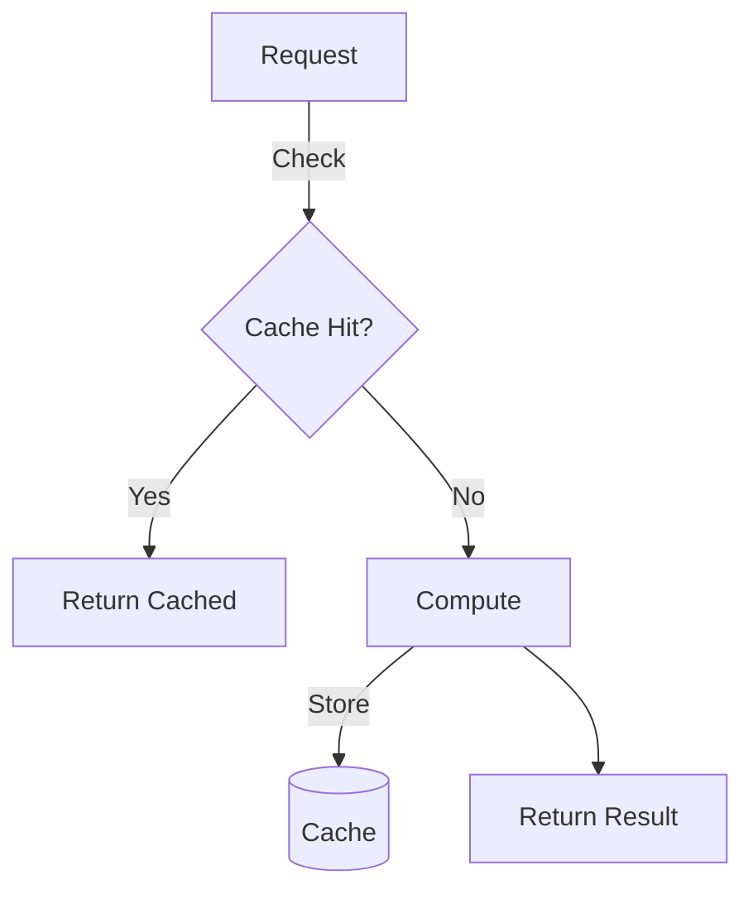

# Data Flow

How data moves through the Fleet Decision Platform from ingestion to output.

## End-to-End Data Pipeline

```mermaid
flowchart LR
    subgraph Sources["Data Sources"]
        NYC[NYC Taxi API/Files]
        NASA[NASA Dataset]
        SIM[Simulation]
    end

    subgraph Ingestion["Ingestion Layer"]
        DOWNLOAD[Download]
        PARSE[Parse/Clean]
        VALIDATE[Validate]
    end

    subgraph Storage["Storage"]
        RAW[(Raw/Parquet)]
        PROC[(Processed)]
        MODEL[(Models)]
    end

    subgraph Transform["Transformation"]
        AGG[Aggregate]
        FEAT[Feature Engineering]
        SPLIT[Train/Test Split]
    end

    subgraph ML["ML Pipeline"]
        TRAIN[Training]
        PREDICT[Prediction]
        EVAL[Evaluation]
    end

    subgraph Output["Output"]
        ALLOC[Allocation Plan]
        KPI[KPIs]
        EXPLAIN[Explanations]
    end

    Sources --> Ingestion
    Ingestion --> RAW
    RAW --> Transform
    Transform --> PROC
    PROC --> ML
    ML --> MODEL
    MODEL --> Output
```



## Data Formats

### Raw Data

| Source | Format | Location |
|--------|--------|----------|
| NYC Taxi | CSV/Parquet | `data/raw/nyc_taxi/` |
| NASA Turbofan | CSV | `data/raw/nasa_turbofan/` |
| Contracts | PDF | `data/raw/contracts/` |

### Processed Data

| Data Type | Format | Location |
|-----------|--------|----------|
| Aggregated Demand | Parquet | `data/processed/demand/` |
| Fleet State | Parquet | `data/processed/fleet_state/` |
| Network Costs | NumPy (.npy) | `data/processed/network/` |
| Features | Parquet | `data/processed/features/` |

### Model Artifacts

| Artifact | Format | Location |
|----------|--------|----------|
| XGBoost Model | Pickle/JSON | `data/models/demand_forecast/` |
| Risk Model | Pickle | `data/models/risk_scoring/` |
| Metadata | JSON | `data/models/*/metadata.json` |

## Stage-by-Stage Flow

### Stage 1: Data Ingestion



**Input:** External APIs/files
**Output:** Clean Parquet files in `data/raw/`

```python
# Example: NYC Taxi ingestion
from src.data.ingestion import DataIngestion

ingestion = DataIngestion(config)
raw_data = ingestion.load_nyc_taxi()
# Returns: DataFrame with columns [pickup_datetime, dropoff_datetime,
#          pickup_location_id, dropoff_location_id, trip_distance, ...]
```

### Stage 2: Feature Engineering



**Input:** Raw data Parquet files
**Output:** Feature matrix for ML

```python
# Example: Feature engineering
from src.data.preprocessing import create_demand_features

features_df, feature_cols = create_demand_features(demand_df)
# Returns: DataFrame with columns [hour, day_of_week, month, is_weekend,
#          demand_lag_1, demand_lag_24, demand_rolling_mean_24, ...]
```

### Stage 3: Model Training



**Input:** Feature matrix
**Output:** Trained model + metrics

```python
# Example: Model training
from src.forecasting import ModelTrainer

trainer = ModelTrainer(config)
model, metrics = trainer.train(features)
trainer.save(model, "data/models/demand_forecast/")
# Metrics: {"rmse": 5.2, "mae": 3.8, "mape": 0.12}
```

### Stage 4: Prediction



**Input:** Features for forecast horizon
**Output:** Demand forecasts per location

```python
# Example: Prediction
from src.forecasting import DemandPredictor

predictor = DemandPredictor(config)
predictor.load_model("data/models/demand_forecast/")
forecasts = predictor.predict(features, horizon_days=7)
# Returns: Dict[str, np.ndarray] - location_id -> hourly forecasts
```

### Stage 5: Optimization



**Input:** Forecasts, fleet state, constraints
**Output:** Allocation plan + KPIs

```python
# Example: Optimization
from src.optimization import CascadingOptimizer

optimizer = CascadingOptimizer(config)
result = optimizer.optimize(
    demand_forecast=forecasts,
    fleet_state=fleet_state,
    network_costs=network_costs,
    constraints=constraints
)
# Returns: OptimizationResult with allocation_plan, total_cost, kpis
```

## Data Validation

Each stage includes validation:

```python
# Schema validation example
from pydantic import BaseModel, validator

class DemandRecord(BaseModel):
    location_id: int
    timestamp: datetime
    demand: float

    @validator('demand')
    def demand_must_be_positive(cls, v):
        if v < 0:
            raise ValueError('demand must be non-negative')
        return v
```

## Caching Strategy



Caching is implemented at:

1. **Data layer:** Processed data cached in Parquet
2. **Model layer:** Model artifacts cached to disk
3. **API layer:** Response caching with Redis (Phase 2+)

## Next Steps

- [Module Design](modules.md) - Detailed module architecture
- [API Reference](../api/index.md) - API data formats
- [Data Formats Reference](../reference/data-formats.md) - Complete schema docs
