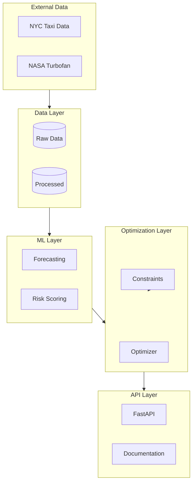
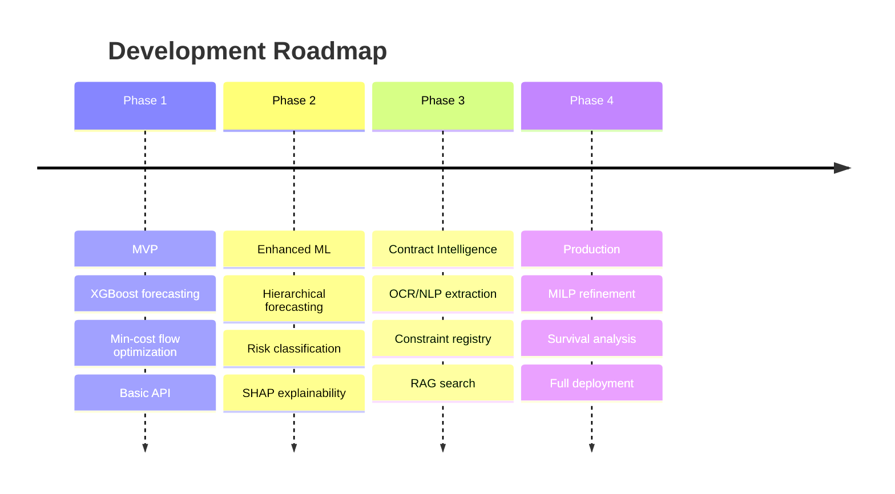

# Architecture Overview

The Fleet Decision Platform follows a modular, pipeline-based architecture designed for scalability and maintainability.

## Design Principles

| Principle | Description |
|-----------|-------------|
| **Modular** | Each capability is a separate, replaceable module |
| **Config-Driven** | All parameters externalized to YAML/JSON |
| **Pipeline-Based** | Clear data flow between stages |
| **API-First** | Everything accessible via REST API |
| **Explainable** | Transparency at every decision point |

## High-Level Architecture

## Layer Details

-   :material-database:{ .lg .middle } __Data Layer__

    ---

    Handles data ingestion, preprocessing, and storage.

    [:octicons-arrow-right-24: Data Flow](data-flow.md)

-   :material-brain:{ .lg .middle } __ML Layer__

    ---

    Demand forecasting and risk prediction models.

    [:octicons-arrow-right-24: Module Design](modules.md)

-   :material-cog:{ .lg .middle } __Optimization Layer__

    ---

    Cascading optimization with constraints.

    [:octicons-arrow-right-24: System Overview](system-overview.md)

-   :material-api:{ .lg .middle } __API Layer__

    ---

    REST API endpoints and documentation.

    [:octicons-arrow-right-24: API Reference](../api/index.md)

## Technology Stack

| Layer | Technologies |
|-------|--------------|
| **Language** | Python 3.9+ |
| **ML** | XGBoost, scikit-learn, (Prophet, PyTorch) |
| **Optimization** | OR-Tools, (PuLP) |
| **API** | FastAPI, Pydantic, Uvicorn |
| **Data** | Pandas, NumPy, PyArrow/Parquet |
| **Database** | PostgreSQL, Redis, (Pinecone) |
| **Documentation** | MkDocs Material |

## Phased Implementation

## Next Steps

- [System Overview](system-overview.md) - Detailed component descriptions
- [Data Flow](data-flow.md) - How data moves through the system
- [Module Design](modules.md) - Individual module architecture
