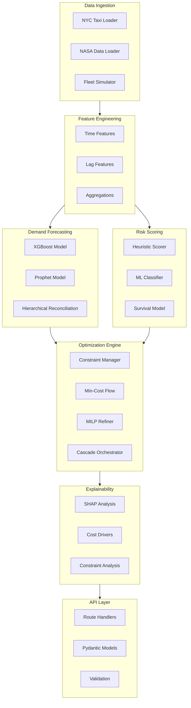
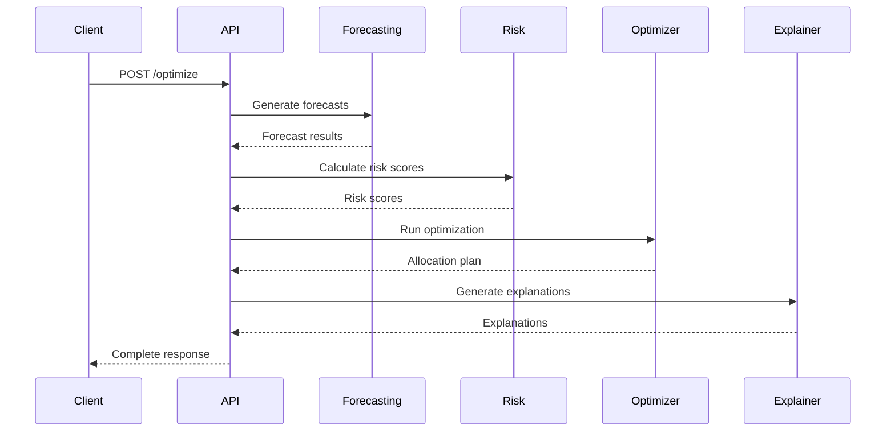

# System Overview

Detailed breakdown of each system component and their interactions.

## Component Architecture



## Component Details

### Data Ingestion (`src/data/`)

| Module | Description | Status |
|--------|-------------|--------|
| `loader.py` | Data loading + synthetic generators | MVP |
| `preprocessing.py` | Data cleaning and transformation | MVP |

```python title="Example: Data Loading"
from src.data.loader import load_nasa_turbofan, load_uber_data

rides_df = load_uber_data("data/raw/nyc_taxi/sample.csv")
train_df, rul_df = load_nasa_turbofan("data/raw/nasa_turbofan", dataset="FD001")
```

### Demand Forecasting (`src/forecasting/`)

| Module | Description | Status |
|--------|-------------|--------|
| `models/xgboost_model.py` | XGBoost forecasting | MVP |
| `models/xgboost_model.py` | XGBoost forecasting | MVP |
| `models/prophet_model.py` | Prophet forecasting | Phase 2 |

```python title="Example: Forecasting"
from src.forecasting.models.xgboost_model import DemandForecaster

forecaster = DemandForecaster()
# forecaster.train(...)  # Train with prepared features
# forecasts = forecaster.predict_by_zone(...)
```

### Risk Scoring (`src/risk/`)

| Module | Description | Status |
|--------|-------------|--------|
| `models/rul_model.py` | Heuristic risk + ML RUL model | MVP |

```python title="Example: Risk Scoring"
from src.risk.models.rul_model import calculate_heuristic_risk

risk_scores = calculate_heuristic_risk(fleet_state_df)
```

### Optimization Engine (`src/optimization/`)

| Module | Description | Status |
|--------|-------------|--------|
| `cascade.py` | Min-cost flow optimization | MVP |
| `solvers/` | Solver integrations (placeholder) | Phase 2 |

```python title="Example: Optimization"
from src.optimization.cascade import FleetOptimizer

optimizer = FleetOptimizer()
result = optimizer.optimize(fleet_df, demand, costs)
```

### Explainability (`src/explainability/`)

| Module | Description | Status |
|--------|-------------|--------|
| `shap_analysis.py` | SHAP for forecasts | Phase 2 |
| `cost_analysis.py` | Cost driver breakdown | MVP |
| `constraint_analysis.py` | Binding constraint analysis | Phase 2 |

### API Layer (`src/api/`)

| Module | Description | Status |
|--------|-------------|--------|
| `main.py` | FastAPI application | MVP |
| `routes/optimize.py` | Optimization endpoint | MVP |
| `routes/forecast.py` | Forecast endpoint | MVP |
| `routes/risk.py` | Risk endpoint | MVP |
| `models/schemas.py` | Request/response schemas | MVP |

## Data Flow Between Components



## Interface Contracts

### Forecast Output Format

```python
{
    "0": [10, 12, 15],  # Hourly demand
    "1": [8, 10, 11],
    ...
}
```

### Risk Score Output Format

```python
pd.DataFrame({
    "vehicle_id": ["V001", "V002", ...],
    "risk_score": [0.2, 0.8, ...],
    "risk_category": ["low", "high", ...]
})
```

### Allocation Plan Format

```python
pd.DataFrame({
    "vehicle_id": ["V001", "V002", ...],
    "from_zone": [1, 2, ...],
    "to_zone": [3, 1, ...],
    "cost": [15.5, 22.0, ...],
    "rebalanced": [True, False, ...]
})
```

## Next Steps

- [Data Flow](data-flow.md) - Detailed data pipeline
- [Module Design](modules.md) - Individual module patterns
- [API Reference](../api/index.md) - API documentation
