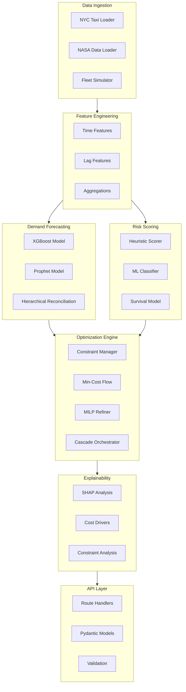
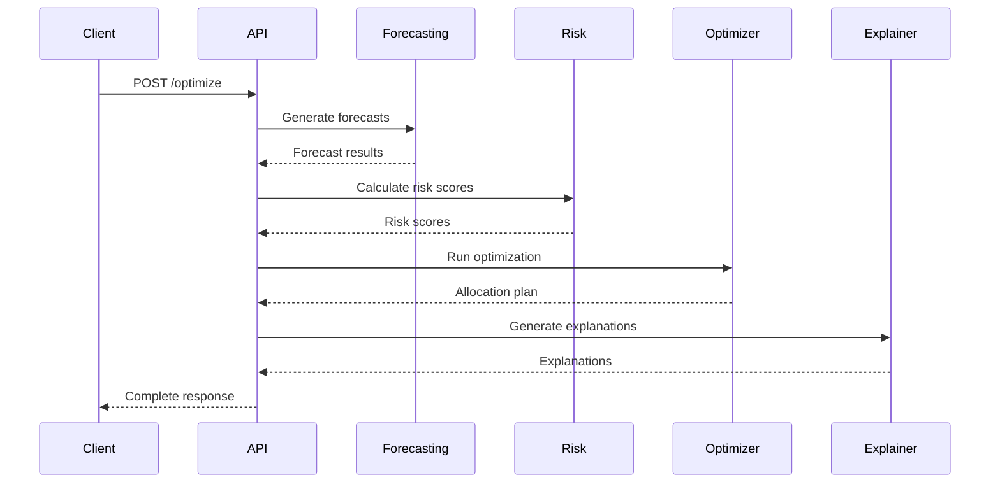

# System Overview

Detailed breakdown of each system component and their interactions.

## Component Architecture



## Component Details

### Data Ingestion (`src/data/`)

| Module | Description | Status |
|--------|-------------|--------|
| `ingestion.py` | Data loading from external sources | MVP |
| `preprocessing.py` | Data cleaning and transformation | MVP |
| `feature_engineering.py` | Feature creation | MVP |
| `simulation.py` | Synthetic fleet data generation | MVP |

```python title="Example: Data Ingestion"
from src.data.ingestion import DataIngestion

ingestion = DataIngestion(config)
demand_data = ingestion.load_nyc_taxi()
risk_data = ingestion.load_nasa_turbofan()
```

### Demand Forecasting (`src/forecasting/`)

| Module | Description | Status |
|--------|-------------|--------|
| `models/xgboost_model.py` | XGBoost forecasting | MVP |
| `models/prophet_model.py` | Prophet forecasting | Phase 2 |
| `trainer.py` | Model training | MVP |
| `predictor.py` | Prediction interface | MVP |
| `hierarchy.py` | Hierarchical reconciliation | Phase 2 |

```python title="Example: Forecasting"
from src.forecasting import DemandPredictor

predictor = DemandPredictor(config)
forecasts = predictor.predict(features, horizon_days=7)
```

### Risk Scoring (`src/risk/`)

| Module | Description | Status |
|--------|-------------|--------|
| `scoring.py` | Risk score calculation | MVP |
| `models/classifier.py` | ML risk classifier | Phase 2 |
| `survival.py` | Survival analysis | Phase 4 |

```python title="Example: Risk Scoring"
from src.risk import RiskScorer

scorer = RiskScorer(config)
risk_scores = scorer.calculate(fleet_state)
```

### Optimization Engine (`src/optimization/`)

| Module | Description | Status |
|--------|-------------|--------|
| `cascade.py` | Orchestrates optimization stages | MVP |
| `min_cost_flow.py` | Min-cost flow solver | MVP |
| `milp.py` | MILP refinement | Phase 4 |
| `constraints.py` | Constraint management | MVP |
| `solvers/ortools_wrapper.py` | OR-Tools integration | MVP |

```python title="Example: Optimization"
from src.optimization import CascadingOptimizer

optimizer = CascadingOptimizer(config)
result = optimizer.optimize(
    demand_forecast=forecasts,
    fleet_state=fleet_state,
    network_costs=costs
)
```

### Explainability (`src/explainability/`)

| Module | Description | Status |
|--------|-------------|--------|
| `shap_analysis.py` | SHAP for forecasts | Phase 2 |
| `cost_analysis.py` | Cost driver breakdown | MVP |
| `constraint_analysis.py` | Binding constraint analysis | Phase 2 |

### API Layer (`src/api/`)

| Module | Description | Status |
|--------|-------------|--------|
| `main.py` | FastAPI application | MVP |
| `routes/optimize.py` | Optimization endpoint | MVP |
| `routes/forecast.py` | Forecast endpoint | MVP |
| `models/requests.py` | Request schemas | MVP |
| `models/responses.py` | Response schemas | MVP |

## Data Flow Between Components



## Interface Contracts

### Forecast Output Format

```python
{
    "location_1": np.array([10, 12, 15, ...]),  # Hourly demand
    "location_2": np.array([8, 10, 11, ...]),
    ...
}
```

### Risk Score Output Format

```python
pd.DataFrame({
    "asset_id": ["V001", "V002", ...],
    "risk_score": [0.2, 0.8, ...],
    "risk_category": ["low", "high", ...]
})
```

### Allocation Plan Format

```python
pd.DataFrame({
    "vehicle_id": ["V001", "V002", ...],
    "source_location": [1, 2, ...],
    "target_location": [3, 1, ...],
    "cost": [15.5, 22.0, ...],
    "assignment": ["rebalance", "stay", ...]
})
```

## Next Steps

- [Data Flow](data-flow.md) - Detailed data pipeline
- [Module Design](modules.md) - Individual module patterns
- [API Reference](../api/index.md) - API documentation
