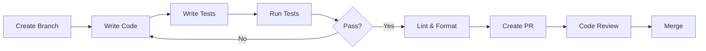

# Developer Guide

Everything you need to contribute to and extend the Fleet Decision Platform.

## Getting Started

<div class="grid cards" markdown>

-   :material-folder-outline:{ .lg .middle } __Project Structure__

    ---

    Understand the codebase organization.

    [:octicons-arrow-right-24: Structure](structure.md)

-   :material-git:{ .lg .middle } __Contributing__

    ---

    How to contribute code and documentation.

    [:octicons-arrow-right-24: Contributing](contributing.md)

-   :material-test-tube:{ .lg .middle } __Testing__

    ---

    Write and run tests effectively.

    [:octicons-arrow-right-24: Testing](testing.md)

-   :material-format-paint:{ .lg .middle } __Code Style__

    ---

    Follow coding standards and conventions.

    [:octicons-arrow-right-24: Code Style](code-style.md)

</div>

## Development Setup

### Quick Setup

```bash
# Clone repository
git clone https://github.com/yourusername/fleet-cascade.git
cd fleet-cascade

# Install all dependencies
uv sync --all-extras

# Set up pre-commit hooks
uv run pre-commit install

# Run tests
uv run pytest
```

### Environment Setup

```bash
# Copy environment template
cp .env.example .env

# Edit with your settings
nano .env
```

## Development Workflow



### Branch Naming

| Type | Pattern | Example |
|------|---------|---------|
| Feature | `feature/description` | `feature/add-prophet-model` |
| Bugfix | `fix/description` | `fix/optimization-timeout` |
| Docs | `docs/description` | `docs/update-api-guide` |
| Refactor | `refactor/description` | `refactor/forecasting-module` |

### Commit Messages

Follow conventional commits:

```
type(scope): description

feat(forecasting): add Prophet model support
fix(api): handle empty forecast requests
docs(readme): update installation instructions
test(optimization): add constraint validation tests
```

## Common Tasks

### Running the API

```bash
# Development mode (with reload)
make run

# Production mode
make run-prod
```

### Running Tests

```bash
# All tests
make test

# With coverage
make test-cov

# Specific module
uv run pytest tests/unit/test_forecasting.py -v
```

### Code Quality

```bash
# Lint and format
make lint
make format

# Pre-commit checks
make pre-commit
```

## Architecture Overview

```
src/
├── data/           # Data ingestion & processing
├── forecasting/    # Demand prediction models
├── optimization/   # Fleet allocation engine
├── risk/           # Risk assessment
├── contracts/      # Contract intelligence (Phase 3)
├── explainability/ # Model explanations
├── api/            # FastAPI application
└── utils/          # Shared utilities
```

## Key Design Decisions

1. **Config-driven:** All parameters in YAML/JSON files
2. **Modular:** Each capability is a separate module
3. **Testable:** Clear interfaces for unit testing
4. **Type-safe:** Type hints throughout
5. **MVP-first:** Simple implementations, enhance later

## Getting Help

- Check existing [GitHub Issues](https://github.com/yourusername/fleet-cascade/issues)
- Read the [Architecture docs](../architecture/index.md)
- Ask in [Discussions](https://github.com/yourusername/fleet-cascade/discussions)
