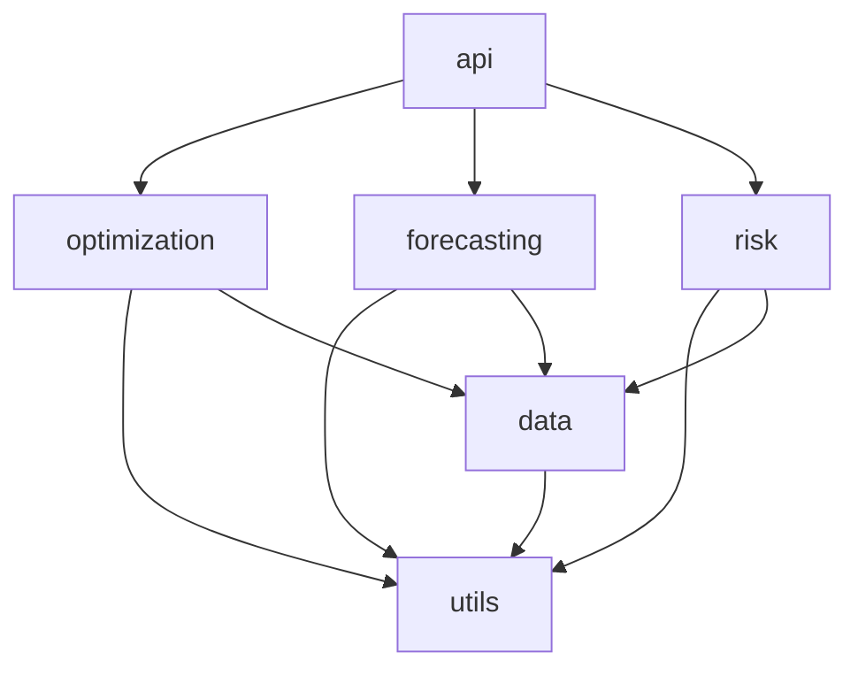

# Project Structure

Detailed guide to the codebase organization.

## Directory Layout

```
fleet-cascade/
├── .cursorrules              # Cursor AI coding guidelines
├── .env.example              # Environment template
├── .gitignore                # Git ignore rules
├── .pre-commit-config.yaml   # Pre-commit hooks
├── Makefile                  # Development commands
├── README.md                 # Project overview
├── mkdocs.yml                # Documentation config
├── plan.md                   # Project plan
├── pyproject.toml            # Package configuration
│
├── config/                   # Configuration files
│   ├── config.yaml           # Main configuration
│   └── constraints/          # Constraint definitions
│       └── fleet_constraints.json
│
├── data/                     # Data directory (gitignored)
│   ├── raw/                  # Raw data files
│   ├── processed/            # Processed data
│   ├── models/               # Trained models
│   └── outputs/              # Generated outputs
│
├── docs/                     # Documentation (MkDocs)
│   ├── index.md              # Homepage
│   ├── getting-started/      # Setup guides
│   ├── architecture/         # System design
│   ├── user-guide/           # User documentation
│   ├── api/                  # API reference
│   ├── developer/            # Developer guide
│   ├── operations/           # Operations guide
│   └── reference/            # Reference docs
│
├── scripts/                  # Utility scripts
│   ├── download_data.py      # Data download
│   ├── generate_fleet.py     # Fleet simulation
│   ├── train_models.py       # Model training
│   └── run_pipeline.py       # Pipeline execution
│
├── src/                      # Source code
│   ├── __init__.py
│   ├── api/                  # FastAPI application
│   ├── contracts/            # Contract intelligence
│   ├── data/                 # Data processing
│   ├── explainability/       # Explainability
│   ├── forecasting/          # Demand forecasting
│   ├── optimization/         # Optimization engine
│   ├── risk/                 # Risk prediction
│   └── utils/                # Shared utilities
│
└── tests/                    # Test suite
    ├── conftest.py           # Pytest fixtures
    ├── fixtures/             # Test data
    ├── integration/          # Integration tests
    └── unit/                 # Unit tests
```

## Source Code Organization

### Data Module (`src/data/`)

```
src/data/
├── __init__.py
├── ingestion.py          # Load data from sources
├── preprocessing.py      # Clean and transform data
├── feature_engineering.py # Create features
└── simulation.py         # Generate synthetic data
```

**Responsibilities:**
- Load raw data from files and APIs
- Clean and validate data
- Create features for ML models
- Generate simulated fleet data

### Forecasting Module (`src/forecasting/`)

```
src/forecasting/
├── __init__.py
├── models/               # Model implementations
│   ├── __init__.py
│   ├── base.py          # Abstract base class
│   ├── xgboost_model.py # XGBoost implementation
│   └── prophet_model.py # Prophet implementation
├── trainer.py           # Model training logic
├── predictor.py         # Prediction interface
└── hierarchy.py         # Hierarchical reconciliation
```

**Responsibilities:**
- Train demand forecasting models
- Generate predictions
- Handle model persistence
- Support multiple model types

### Optimization Module (`src/optimization/`)

```
src/optimization/
├── __init__.py
├── cascade.py           # Orchestrate optimization stages
├── min_cost_flow.py     # Min-cost flow implementation
├── milp.py              # MILP refinement
├── constraints.py       # Constraint management
└── solvers/             # Solver wrappers
    ├── __init__.py
    ├── base.py          # Abstract solver
    └── ortools_wrapper.py # OR-Tools wrapper
```

**Responsibilities:**
- Run optimization algorithms
- Manage constraints
- Coordinate multiple stages
- Wrap solver libraries

### Risk Module (`src/risk/`)

```
src/risk/
├── __init__.py
├── scoring.py           # Risk score calculation
├── survival.py          # Survival analysis
└── models/              # Risk models
    ├── __init__.py
    └── classifier.py    # ML risk classifier
```

**Responsibilities:**
- Calculate risk scores
- Categorize risk levels
- Support multiple scoring methods

### API Module (`src/api/`)

```
src/api/
├── __init__.py
├── main.py              # FastAPI application
├── routes/              # API endpoints
│   ├── __init__.py
│   ├── optimize.py      # Optimization endpoint
│   ├── forecast.py      # Forecast endpoint
│   └── explain.py       # Explainability endpoint
├── models/              # Pydantic schemas
│   ├── __init__.py
│   ├── requests.py      # Request models
│   └── responses.py     # Response models
└── utils.py             # API utilities
```

**Responsibilities:**
- Define REST endpoints
- Validate requests/responses
- Handle authentication (future)
- Manage API versioning

### Utils Module (`src/utils/`)

```
src/utils/
├── __init__.py
├── config.py            # Configuration loading
├── logging.py           # Logging setup
└── metrics.py           # KPI calculations
```

**Responsibilities:**
- Load configuration files
- Set up logging
- Common utility functions
- KPI calculations

## Import Conventions

```python
# Standard library
import logging
from pathlib import Path
from typing import Dict, List, Optional

# Third-party
import pandas as pd
import numpy as np
from fastapi import APIRouter

# Local imports
from src.utils.config import load_config
from src.forecasting.models.xgboost_model import XGBoostForecastModel
```

## Module Dependencies



## Configuration Files

| File | Purpose |
|------|---------|
| `config/config.yaml` | Main configuration |
| `config/constraints/*.json` | Constraint definitions |
| `pyproject.toml` | Package metadata, tools |
| `mkdocs.yml` | Documentation config |
| `.pre-commit-config.yaml` | Code quality hooks |

## Next Steps

- [Contributing](contributing.md) - How to contribute
- [Testing](testing.md) - Testing guide
- [Code Style](code-style.md) - Coding standards
