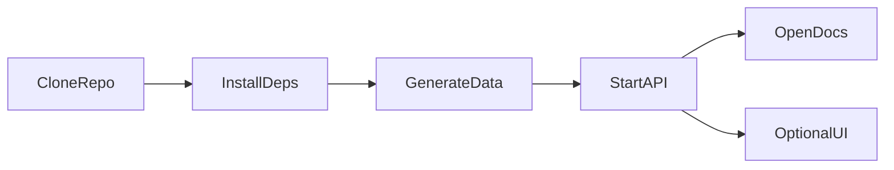
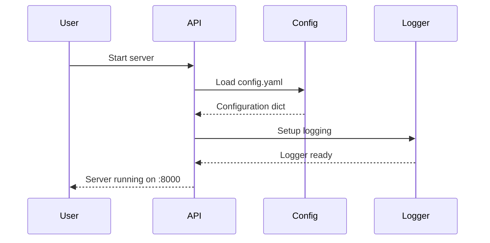

# Quick Start

Get the Fleet Decision Platform running in under 5 minutes!

## TL;DR

```bash
# One-liner setup
git clone https://github.com/Ashraf0001/Data-Driven-Fleet-Cascade.git && cd Data-Driven-Fleet-Cascade && uv sync && make run
```

Then visit [http://localhost:8000/docs](http://localhost:8000/docs) for the API documentation.

---

## Step-by-Step Guide

## Quick Start Flow



### 1. Generate Sample Data

Since downloading real data requires Kaggle credentials, let's start with simulated data:

```bash
# Generate fleet state and network costs
uv run python scripts/generate_fleet.py

# Output:
# Fleet state saved to: data/processed/fleet_state/fleet_state.parquet
# Network costs saved to: data/processed/fleet_state/network_costs.npy
# Location metadata saved to: data/processed/fleet_state/locations.parquet
```

### 2. Start the API Server

```bash
# Start development server
make run

# Or directly with uvicorn
uv run uvicorn src.api.main:app --reload --port 8000
```

You should see:

```
INFO:     Uvicorn running on http://0.0.0.0:8000 (Press CTRL+C to quit)
INFO:     Started reloader process
INFO:     Starting Fleet Decision Platform API
```

### 3. Start the Dashboard (Optional)

For a visual interface, run the Streamlit dashboard:

```bash
make streamlit

# Or directly with streamlit
uv run streamlit run app.py --server.port 8501
```

The dashboard will be available at [http://localhost:8501](http://localhost:8501).

To run both the API and dashboard together:

```bash
make demo
```

### 4. Explore the API

Open your browser to [http://localhost:8000/docs](http://localhost:8000/docs) to see the interactive API documentation.

### 5. Make Your First API Call

=== "cURL"

    ```bash
    # Health check
    curl http://localhost:8000/health

    # Get configuration
    curl http://localhost:8000/api/v1/config

    # Run optimization (minimal example)
    curl -X POST http://localhost:8000/api/v1/optimize \
      -H "Content-Type: application/json" \
      -d '{
        "demand_forecast": {"0": [10], "1": [15], "2": [8]},
        "fleet_state": {"vehicles": [
          {"vehicle_id": "V001", "current_zone": 0, "status": "operational"},
          {"vehicle_id": "V002", "current_zone": 1, "status": "operational"}
        ]},
        "constraints": {"max_cost_per_vehicle": 50}
      }'
    ```

=== "Python"

    ```python
    import httpx

    # Health check
    response = httpx.get("http://localhost:8000/health")
    print(response.json())
    # {"status": "healthy"}

    # Get configuration
    response = httpx.get("http://localhost:8000/api/v1/config")
    print(response.json())
    ```

=== "HTTPie"

    ```bash
    # Health check
    http GET localhost:8000/health

    # Get configuration
    http GET localhost:8000/api/v1/config
    ```

### 6. Download Real Data (Optional) {#download-data}

To use real NYC Taxi data:

```bash
# Set up Kaggle credentials first
# Get your API key from: https://www.kaggle.com/settings

# Option 1: Environment variables
export KAGGLE_USERNAME=your_username
export KAGGLE_KEY=your_api_key

# Option 2: Kaggle config file
mkdir -p ~/.kaggle
echo '{"username":"your_username","key":"your_api_key"}' > ~/.kaggle/kaggle.json
chmod 600 ~/.kaggle/kaggle.json

# Download datasets
uv run python scripts/download_data.py
```

## What's Happening?

Here's what the platform does when you start it:



## Available Make Commands

```bash
make help           # Show all commands
make run            # Start API server
make streamlit      # Start Streamlit dashboard
make demo           # Start API + dashboard together
make test           # Run tests
make lint           # Check code style
make format         # Format code
make download       # Download datasets
make generate-fleet # Generate simulated data
make docs           # Serve documentation
```

## Common Issues

??? warning "Port 8000 already in use"

    ```bash
    # Find and kill the process
    lsof -i :8000
    kill -9 <PID>

    # Or use a different port
    uv run uvicorn src.api.main:app --port 8001
    ```

??? warning "Module not found errors"

    Ensure you've installed the package:
    ```bash
    uv sync
    ```

## Next Steps

Now that you have the platform running:

1. **[Configure the Platform](configuration.md)** - Customize settings for your use case
2. **[Understand the Architecture](../architecture/index.md)** - Learn how components interact
3. **[Explore the API](../api/index.md)** - Full API reference
4. **[User Guide](../user-guide/index.md)** - Detailed usage instructions
