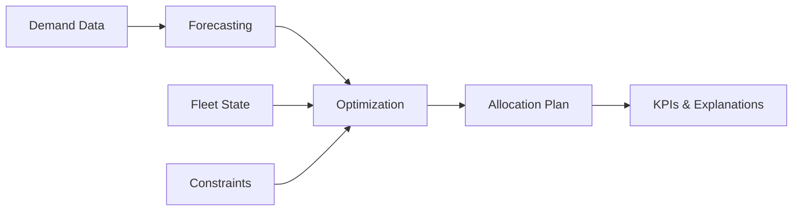
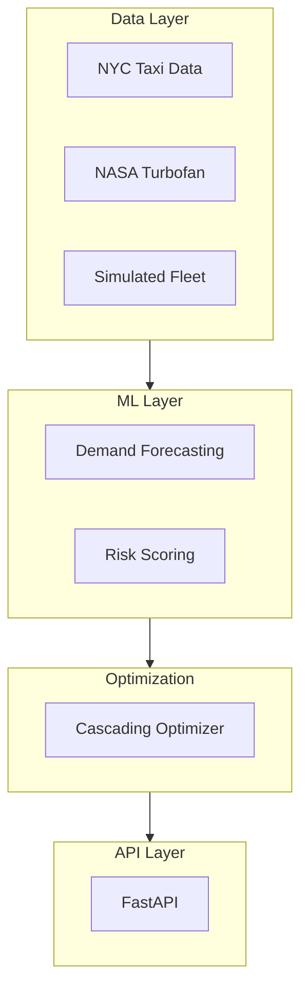

# Fleet Decision Platform

<div class="grid cards" markdown>

-   :material-clock-fast:{ .lg .middle } __Set up in 5 minutes__

    ---

    Get up and running with the Fleet Decision Platform quickly using our streamlined installation process.

    [:octicons-arrow-right-24: Getting Started](getting-started/index.md)

-   :material-cog:{ .lg .middle } __Highly Configurable__

    ---

    Customize every aspect of the platform through YAML configuration files without changing code.

    [:octicons-arrow-right-24: Configuration](getting-started/configuration.md)

-   :material-chart-line:{ .lg .middle } __Demand Forecasting__

    ---

    Multi-location time-series forecasting with XGBoost, Prophet, and hierarchical reconciliation.

    [:octicons-arrow-right-24: Forecasting Guide](user-guide/forecasting.md)

-   :material-truck:{ .lg .middle } __Fleet Optimization__

    ---

    Cascading optimization with min-cost flow and MILP for cost-effective fleet allocation.

    [:octicons-arrow-right-24: Optimization Guide](user-guide/optimization.md)

</div>

---

## Overview

The **Fleet Decision Platform** is an enterprise-grade decision intelligence system that transforms demand forecasts, contract rules, and risk predictions into explainable, cost-optimized fleet allocation decisions.



## Key Capabilities

| Capability | Description | Phase |
|------------|-------------|-------|
| **Demand Forecasting** | Multi-location time-series with XGBoost/Prophet | MVP |
| **Fleet Optimization** | Min-cost flow + MILP cascading optimization | MVP |
| **Risk Prediction** | Asset failure and violation prediction | Phase 2 |
| **Contract Intelligence** | NLP extraction from contract PDFs | Phase 3 |
| **Explainability** | SHAP analysis and cost drivers | Phase 2 |

## Quick Start

=== "Installation"

    ```bash
    # Clone the repository
    git clone https://github.com/yourusername/fleet-cascade.git
    cd fleet-cascade

    # Install dependencies
    uv sync

    # Run the API
    make run
    ```

=== "API Usage"

    ```python
    import httpx

    response = httpx.post(
        "http://localhost:8000/api/v1/optimize",
        json={
            "demand_forecast": {...},
            "fleet_state": {...},
            "constraints": {...}
        }
    )
    result = response.json()
    ```

=== "Configuration"

    ```yaml
    # config/config.yaml
    forecasting:
      model: "xgboost"
      horizon_days: 7

    optimization:
      solver: "ortools"
      constraints:
        max_distance: 100
    ```

## Who Is This For?

<div class="grid" markdown>

:fontawesome-solid-user-tie: **Business Stakeholders**
:   Understand fleet optimization outcomes, KPIs, and business impact through intuitive dashboards and reports.

:fontawesome-solid-code: **Developers**
:   Build and extend the platform with our modular, well-documented codebase and API.

:fontawesome-solid-server: **Operations Teams**
:   Deploy, monitor, and maintain the platform in production environments.

:fontawesome-solid-graduation-cap: **Data Scientists**
:   Experiment with forecasting models, optimization algorithms, and feature engineering.

</div>

## Architecture at a Glance



## Project Status

!!! info "Current Phase: MVP (Phase 1)"

    The platform is currently in MVP development, focusing on:

    - [x] Project structure and configuration
    - [x] Data ingestion pipeline
    - [ ] XGBoost demand forecasting
    - [ ] Min-cost flow optimization
    - [ ] Basic API endpoints
    - [ ] Integration testing

## Getting Help

- :material-book: [Documentation](getting-started/index.md) - Comprehensive guides and references
- :material-github: [GitHub Issues](https://github.com/yourusername/fleet-cascade/issues) - Bug reports and feature requests
- :material-email: [Contact](mailto:your.email@example.com) - Direct support

---

<div class="grid cards" markdown>

-   :material-scale-balance:{ .lg .middle } __Open Source__

    ---

    Licensed under MIT. Free to use, modify, and distribute.

-   :material-update:{ .lg .middle } __Actively Maintained__

    ---

    Regular updates and improvements based on community feedback.

</div>
