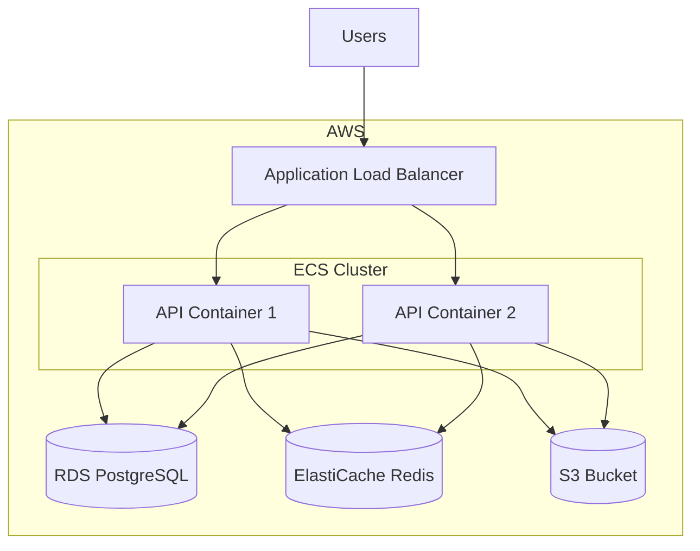

# Deployment Guide

Deploy the Fleet Decision Platform to production environments.

## Deployment Options

| Option | Complexity | Use Case |
|--------|------------|----------|
| Local/VM | Low | Development, testing |
| Docker | Medium | Staging, small production |
| Kubernetes | High | Large-scale production |
| AWS ECS | Medium | Cloud-native deployment |

## Local Deployment

### Prerequisites

```bash
# Install dependencies
uv sync

# Configure environment
cp .env.example .env
nano .env
```

### Start Server

```bash
# Development mode
make run

# Production mode
uvicorn src.api.main:app --host 0.0.0.0 --port 8000 --workers 4
```

### Verify Deployment

```bash
curl http://localhost:8000/health
# {"status": "healthy"}
```

---

## Docker Deployment

### Dockerfile

```dockerfile
# docker/Dockerfile
FROM python:3.12-slim

WORKDIR /app

# Install uv
RUN pip install uv

# Copy dependency files
COPY pyproject.toml uv.lock ./

# Install dependencies
RUN uv sync --no-dev

# Copy source code
COPY src/ src/
COPY config/ config/

# Expose port
EXPOSE 8000

# Run application
CMD ["uv", "run", "uvicorn", "src.api.main:app", "--host", "0.0.0.0", "--port", "8000"]
```

### Docker Compose

```yaml
# docker-compose.yml
version: '3.8'

services:
  api:
    build:
      context: .
      dockerfile: docker/Dockerfile
    ports:
      - "8000:8000"
    environment:
      - LOG_LEVEL=INFO
    volumes:
      - ./config:/app/config:ro
      - ./data:/app/data
    restart: unless-stopped
    healthcheck:
      test: ["CMD", "curl", "-f", "http://localhost:8000/health"]
      interval: 30s
      timeout: 10s
      retries: 3

  postgres:
    image: postgres:15-alpine
    environment:
      POSTGRES_DB: fleet_db
      POSTGRES_USER: fleet_user
      POSTGRES_PASSWORD: ${POSTGRES_PASSWORD}
    volumes:
      - postgres_data:/var/lib/postgresql/data
    ports:
      - "5432:5432"

  redis:
    image: redis:7-alpine
    ports:
      - "6379:6379"
    volumes:
      - redis_data:/data

volumes:
  postgres_data:
  redis_data:
```

### Deploy with Docker

```bash
# Build and start
docker-compose up -d --build

# View logs
docker-compose logs -f api

# Stop services
docker-compose down
```

---

## AWS Deployment (Phase 4)

### Architecture



### AWS CLI Commands

```bash
# Push image to ECR
aws ecr get-login-password --region us-east-1 | docker login --username AWS --password-stdin $ECR_URI
docker build -t fleet-cascade .
docker tag fleet-cascade:latest $ECR_URI/fleet-cascade:latest
docker push $ECR_URI/fleet-cascade:latest

# Deploy to ECS
aws ecs update-service --cluster fleet-cluster --service fleet-api --force-new-deployment
```

---

## Environment Configuration

### Production Environment Variables

```bash
# .env.production
# Database
POSTGRES_HOST=your-rds-endpoint.amazonaws.com
POSTGRES_DB=fleet_db
POSTGRES_USER=fleet_user
POSTGRES_PASSWORD=<secure-password>

# Cache
REDIS_HOST=your-elasticache-endpoint.amazonaws.com
REDIS_PORT=6379

# API
APP_HOST=0.0.0.0
APP_PORT=8000
LOG_LEVEL=INFO

# Security
SECRET_KEY=<generated-secret-key>
```

### Secrets Management

```bash
# Store secrets in AWS Secrets Manager
aws secretsmanager create-secret \
  --name fleet-cascade/production \
  --secret-string '{"POSTGRES_PASSWORD":"...", "SECRET_KEY":"..."}'

# Retrieve in application
import boto3
secrets = boto3.client('secretsmanager')
secret = secrets.get_secret_value(SecretId='fleet-cascade/production')
```

---

## Scaling

### Horizontal Scaling

```yaml
# docker-compose.yml
services:
  api:
    deploy:
      replicas: 4
      resources:
        limits:
          cpus: '1'
          memory: 2G
```

### Load Balancing

```nginx
# nginx.conf
upstream fleet_api {
    least_conn;
    server api1:8000;
    server api2:8000;
    server api3:8000;
}

server {
    listen 80;
    location / {
        proxy_pass http://fleet_api;
        proxy_set_header Host $host;
        proxy_set_header X-Real-IP $remote_addr;
    }
}
```

---

## Security Checklist

- [ ] HTTPS/TLS enabled
- [ ] API authentication configured
- [ ] Secrets in environment variables or secrets manager
- [ ] Database credentials secured
- [ ] Network security groups configured
- [ ] Input validation enabled
- [ ] Rate limiting configured
- [ ] CORS properly configured

---

## Rollback Procedure

### Docker

```bash
# Rollback to previous version
docker-compose down
docker tag fleet-cascade:latest fleet-cascade:broken
docker tag fleet-cascade:previous fleet-cascade:latest
docker-compose up -d
```

### AWS ECS

```bash
# Rollback to previous task definition
aws ecs update-service \
  --cluster fleet-cluster \
  --service fleet-api \
  --task-definition fleet-api:PREVIOUS_VERSION
```

## Next Steps

- [Monitoring](monitoring.md) - Set up observability
- [Troubleshooting](troubleshooting.md) - Resolve issues
