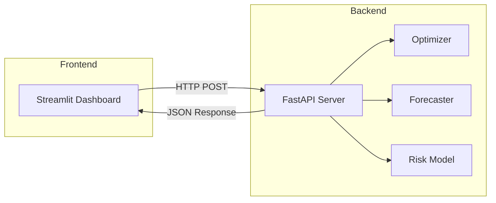

# Dashboard

The Fleet Decision Platform includes a Streamlit dashboard for visual interaction with the platform's features.

## Starting the Dashboard

### Quick Start

```bash
# Start both API and Dashboard
make demo
```

This starts:

- **API Server**: [http://localhost:8000](http://localhost:8000)
- **Dashboard**: [http://localhost:8501](http://localhost:8501)

### Dashboard Only

If the API is already running:

```bash
make streamlit

# Or directly:
uv run streamlit run app.py --server.port 8501
```

## Dashboard Pages

The dashboard has four main pages accessible via the sidebar:

### 1. Overview

The landing page provides a summary of the platform's capabilities:

- Platform description
- Key features overview
- Quick links to other sections

### 2. Fleet Optimization

Run fleet allocation optimization with customizable parameters:

**Input Parameters:**

| Parameter | Description | Default |
|-----------|-------------|---------|
| Number of Vehicles | Total fleet size | 50 |
| Number of Zones | Service locations | 10 |
| Max Distance | Maximum travel distance constraint | 100 |
| Max Capacity | Vehicle capacity limit | 10 |

**Process:**

1. Adjust parameters using the sidebar sliders
2. Click "Run Optimization"
3. View results including:
    - Allocation summary table
    - Total cost breakdown
    - Demand coverage metrics
    - Zone-to-zone flow visualization

### 3. Demand Forecast

Generate demand predictions across zones:

**Input Parameters:**

| Parameter | Description | Default |
|-----------|-------------|---------|
| Number of Zones | Forecast locations | 10 |
| Forecast Horizon | Days to forecast | 7 |
| Use ML Model | Enable XGBoost predictions | No |

**Output:**

- Forecast table by zone and day
- Summary statistics
- Average demand per zone

### 4. Risk Analysis

Assess fleet risk levels:

**Input Parameters:**

| Parameter | Description | Default |
|-----------|-------------|---------|
| Number of Assets | Vehicles to analyze | 20 |
| Warning Threshold | RUL warning level | 50 |
| Critical Threshold | RUL critical level | 20 |

**Output:**

- Risk score table per asset
- Risk category distribution (pie chart)
- Threshold configuration display

## Architecture

The dashboard communicates with the FastAPI backend:



## API Endpoints Used

The dashboard calls these API endpoints:

| Page | Endpoint | Method |
|------|----------|--------|
| Optimization | `/api/v1/optimize/simulate` | POST |
| Forecast | `/api/v1/forecast` | POST |
| Risk | `/api/v1/risk/score` | POST |

## Troubleshooting

??? warning "Dashboard not loading"

    Ensure the API server is running:
    ```bash
    curl http://localhost:8000/health
    ```

    If not, start it with:
    ```bash
    make run
    ```

??? warning "API connection errors"

    The dashboard expects the API at `http://localhost:8000`. If using a different port, update the API URL in `app.py`:
    ```python
    API_BASE_URL = "http://localhost:8000"
    ```

??? warning "Port 8501 already in use"

    ```bash
    # Find and kill the process
    lsof -i :8501
    kill -9 <PID>

    # Or use a different port
    uv run streamlit run app.py --server.port 8502
    ```

## Customization

The dashboard is defined in `app.py` at the project root. Key sections:

```python
# API configuration
API_BASE_URL = "http://localhost:8000"

# Page definitions
PAGES = {
    "Overview": overview_page,
    "Fleet Optimization": optimization_page,
    "Demand Forecast": forecast_page,
    "Risk Analysis": risk_page,
}
```

To add a new page:

1. Define a page function in `app.py`
2. Add it to the `PAGES` dictionary
3. The page will automatically appear in the sidebar

## Next Steps

- [API Reference](../api/index.md) - Full API documentation
- [Optimization Guide](optimization.md) - Detailed optimization usage
- [Forecasting Guide](forecasting.md) - Forecasting configuration
