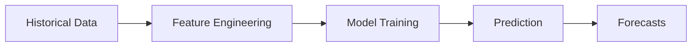
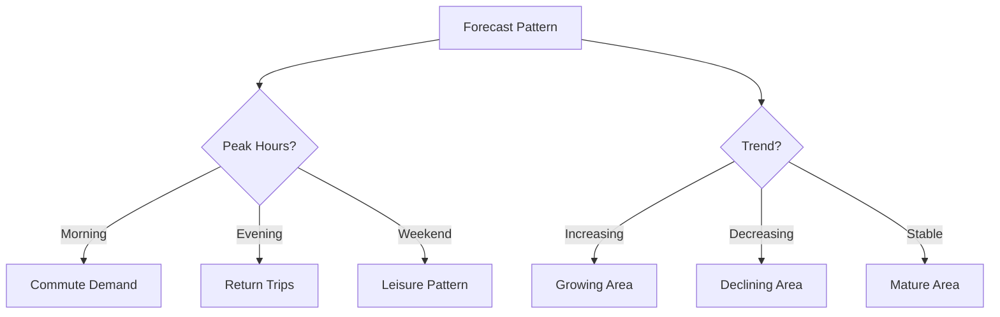

# Demand Forecasting

Generate accurate demand forecasts for your fleet service locations.

## Overview

The forecasting module predicts future demand using:

- **XGBoost** (MVP) - Gradient boosting for tabular data
- **Prophet** (Phase 2) - Facebook's time-series model
- **TFT** (Phase 4) - Temporal Fusion Transformer

## How It Works



### Features Used

| Feature | Description | Type |
|---------|-------------|------|
| `hour` | Hour of day (0-23) | Temporal |
| `day_of_week` | Day of week (0-6) | Temporal |
| `month` | Month (1-12) | Temporal |
| `is_weekend` | Weekend flag | Binary |
| `lag_1h` | Demand 1 hour ago | Lag |
| `lag_24h` | Demand 24 hours ago | Lag |
| `lag_168h` | Demand 1 week ago | Lag |

## Usage

### Via API

```bash
curl -X POST http://localhost:8000/api/v1/forecast \
  -H "Content-Type: application/json" \
  -d '{
    "location_ids": [1, 2, 3],
    "horizon_hours": 168,
    "include_intervals": false
  }'
```

### Via Python

```python
from src.forecasting import DemandPredictor
from src.utils.config import load_config

# Load configuration
config = load_config()

# Initialize predictor
predictor = DemandPredictor(config)

# Load trained model
predictor.load_model("data/models/demand_forecast/")

# Generate forecasts
forecasts = predictor.predict(
    features=feature_data,
    horizon_days=7
)

# Results: Dict[location_id, np.ndarray of hourly forecasts]
for location, forecast in forecasts.items():
    print(f"Location {location}: {len(forecast)} hours")
    print(f"  Mean demand: {forecast.mean():.1f}")
    print(f"  Max demand: {forecast.max():.1f}")
```

## Training a Model

### Prepare Data

```python
from src.data.ingestion import DataIngestion
from src.data.feature_engineering import FeatureEngineer

# Load raw data
ingestion = DataIngestion(config)
raw_data = ingestion.load_nyc_taxi()

# Create features
engineer = FeatureEngineer(config)
features = engineer.create_features(raw_data)
```

### Train Model

```python
from src.forecasting import ModelTrainer

# Initialize trainer
trainer = ModelTrainer(config)

# Train model
model, metrics = trainer.train(features)

# Review metrics
print(f"RMSE: {metrics['rmse']:.2f}")
print(f"MAE: {metrics['mae']:.2f}")
print(f"MAPE: {metrics['mape']:.1%}")

# Save model
trainer.save(model, "data/models/demand_forecast/")
```

## Model Configuration

Configure forecasting in `config/config.yaml`:

```yaml
forecasting:
  model: "xgboost"
  horizon_days: 7

  features:
    - hour
    - day_of_week
    - month
    - is_weekend
    - lag_1h
    - lag_24h
    - lag_168h

  xgboost:
    n_estimators: 100
    max_depth: 6
    learning_rate: 0.1
    min_child_weight: 1
    subsample: 0.8
    colsample_bytree: 0.8

  training:
    train_split: 0.8
    validation_split: 0.1
    test_split: 0.1
```

## Interpreting Results

### Forecast Output

```python
{
    "1": [15, 18, 22, 25, ...],  # Hourly demand for location 1
    "2": [10, 12, 14, 16, ...],  # Hourly demand for location 2
    "3": [8, 9, 11, 13, ...],    # Hourly demand for location 3
}
```

### Understanding Patterns



## Evaluation Metrics

| Metric | Description | Target |
|--------|-------------|--------|
| RMSE | Root Mean Square Error | Lower is better |
| MAE | Mean Absolute Error | Lower is better |
| MAPE | Mean Absolute Percentage Error | < 15% |

## Best Practices

!!! tip "Data Requirements"

    - Minimum 3 months of historical data
    - At least hourly granularity
    - Complete coverage of all locations

!!! tip "Feature Engineering"

    - Add domain-specific features (events, weather)
    - Test different lag features
    - Consider holiday calendars

!!! warning "Common Issues"

    - **High MAPE:** Check for outliers in training data
    - **Overfitting:** Reduce model complexity
    - **Underfitting:** Add more features

## Next Steps

- [Optimization Guide](optimization.md) - Use forecasts in optimization
- [Results Guide](results.md) - Interpret forecast outputs
- [API Reference](../api/endpoints.md) - Forecast endpoint details
