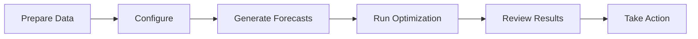

# User Guide

Learn how to use the Fleet Decision Platform to optimize your fleet operations.

## Overview

The platform helps you:

- **Forecast demand** across multiple locations
- **Optimize fleet allocation** to minimize costs
- **Assess risks** for your vehicle fleet
- **Understand decisions** through explainability features

## Workflow



## Interaction Methods

Choose how you want to interact with the platform:

| Method | Description | Best For |
|--------|-------------|----------|
| **[Dashboard](dashboard.md)** | Streamlit visual interface | Exploration, testing, demos |
| **[API](../api/index.md)** | REST endpoints | Integration, automation |
| **Notebook** | Jupyter walkthrough (`fleet_cascade_overview.ipynb`) | Analysis, prototyping |
| **Python** | Direct module imports | Custom pipelines |

For quick testing, we recommend starting with the **Dashboard**:

```bash
make demo  # Starts both API and Dashboard
```

Then visit [http://localhost:8501](http://localhost:8501).

## Getting Started

<div class="grid cards" markdown>

-   :material-chart-line:{ .lg .middle } __Demand Forecasting__

    ---

    Predict future demand across your service locations.

    [:octicons-arrow-right-24: Forecasting Guide](forecasting.md)

-   :material-truck:{ .lg .middle } __Fleet Optimization__

    ---

    Generate cost-optimal fleet allocation plans.

    [:octicons-arrow-right-24: Optimization Guide](optimization.md)

-   :material-alert:{ .lg .middle } __Risk Assessment__

    ---

    Identify high-risk vehicles in your fleet.

    [:octicons-arrow-right-24: Risk Guide](risk.md)

-   :material-file-document:{ .lg .middle } __Understanding Results__

    ---

    Interpret optimization outputs and KPIs.

    [:octicons-arrow-right-24: Results Guide](results.md)

</div>

## Quick Example

Here's a typical workflow:

```python
from src.data.loader import generate_demand_forecast, generate_fleet_state, generate_network_costs
from src.optimization.cascade import FleetOptimizer

# 1. Generate inputs
n_zones = 9
fleet_state = generate_fleet_state(n_vehicles=20, n_zones=n_zones, seed=42)
demand = generate_demand_forecast(n_zones=n_zones, hour=18, day_of_week=4, seed=42)
network_costs = generate_network_costs(n_zones=n_zones, seed=42)

# 2. Run optimization
optimizer = FleetOptimizer(max_cost_per_vehicle=50.0, min_service_level=0.0)
result = optimizer.optimize(fleet_df=fleet_state, demand=demand, costs=network_costs)

# 3. Review results
print(f"Total Cost: ${result.total_cost:,.2f}")
print(f"Utilization: {result.kpis['utilization']:.1%}")
```

## Use Cases

### Daily Fleet Rebalancing

Optimize vehicle distribution across locations based on predicted demand:

1. Generate next-day demand forecasts
2. Run optimization with current fleet state
3. Execute rebalancing plan

### Weekly Planning

Plan fleet operations for the upcoming week:

1. Generate 7-day forecasts
2. Identify capacity constraints
3. Schedule maintenance windows
4. Generate daily rebalancing plans

### Risk-Based Maintenance

Prioritize vehicle maintenance based on risk scores:

1. Calculate risk scores for all vehicles
2. Identify high-risk vehicles
3. Schedule preventive maintenance
4. Update fleet state

## Best Practices

!!! tip "Data Quality"

    Ensure your input data is:

    - **Complete:** No missing values in critical fields
    - **Recent:** Use the latest available data
    - **Accurate:** Validate against ground truth

!!! tip "Configuration"

    - Start with default settings
    - Tune parameters based on results
    - Document any custom configurations

!!! tip "Monitoring"

    - Track forecast accuracy over time
    - Monitor optimization KPIs
    - Alert on anomalies

## Next Steps

Choose your focus area:

- [Dashboard Guide](dashboard.md) - Use the visual interface
- [Forecasting Guide](forecasting.md) - Learn demand forecasting
- [Optimization Guide](optimization.md) - Master fleet optimization
- [Risk Guide](risk.md) - Understand risk assessment
- [Results Guide](results.md) - Interpret outputs
