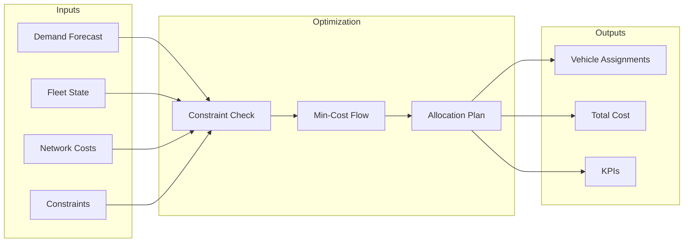
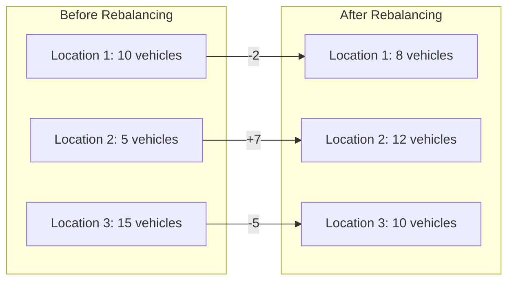

# Fleet Optimization

Generate cost-optimal fleet allocation and rebalancing plans.

## Overview

The optimization engine uses cascading stages:

1. **Min-Cost Flow** (MVP) - Minimize rebalancing costs
2. **Critical Demand** (Phase 2) - Ensure service levels
3. **MILP Refinement** (Phase 4) - Handle discrete constraints

## How It Works



## Usage

### Via API

```bash
curl -X POST http://localhost:8000/api/v1/optimize \
  -H "Content-Type: application/json" \
  -d '{
    "demand_forecast": {
      "1": [15, 18, 22],
      "2": [10, 12, 14],
      "3": [8, 9, 11]
    },
    "fleet_state": {
      "vehicles": [
        {"id": "V001", "location": 1, "capacity": 1},
        {"id": "V002", "location": 2, "capacity": 1}
      ]
    },
    "constraints": {
      "max_distance": 100,
      "min_service_level": 0.95
    }
  }'
```

### Via Python

```python
from src.optimization import CascadingOptimizer
from src.utils.config import load_config

# Load configuration
config = load_config()

# Initialize optimizer
optimizer = CascadingOptimizer(config)

# Run optimization
result = optimizer.optimize(
    demand_forecast=forecasts,
    fleet_state=fleet_state,
    network_costs=network_costs,
    constraints=constraints
)

# Review results
print(f"Status: {result.status}")
print(f"Total Cost: ${result.total_cost:,.2f}")
print(f"Vehicles Rebalanced: {result.kpis['rebalanced_count']}")
print(f"Demand Coverage: {result.kpis['demand_coverage']:.1%}")
```

## Understanding the Problem

### Min-Cost Flow Formulation

The optimization minimizes total rebalancing cost:

$$
\min \sum_{i,j} c_{ij} \cdot x_{ij}
$$

Subject to:
- Supply constraints: vehicles available at each location
- Demand constraints: demand to serve at each location
- Flow conservation: inflow = outflow for transit nodes

### Decision Variables

| Variable | Description |
|----------|-------------|
| $x_{ij}$ | Number of vehicles moving from location $i$ to $j$ |

### Parameters

| Parameter | Description |
|-----------|-------------|
| $c_{ij}$ | Cost to move one vehicle from $i$ to $j$ |
| $s_i$ | Supply (vehicles) at location $i$ |
| $d_j$ | Demand at location $j$ |

## Configuration

```yaml title="config/config.yaml"
optimization:
  solver: "ortools"

  stages:
    - min_cost_flow
    # - critical_demand  # Phase 2
    # - milp_refinement  # Phase 4

  constraints:
    max_distance: 100
    capacity_per_vehicle: 1
    min_service_level: 0.95
    max_rebalancing_cost: 10000

  solver_settings:
    time_limit_seconds: 60
    optimality_gap: 0.01
```

## Constraint Types

### Capacity Constraints

```json
{
  "max_vehicles_per_location": 20,
  "min_vehicles_per_location": 2,
  "total_fleet_size": 50
}
```

### Operational Constraints

```json
{
  "max_rebalancing_distance_km": 100,
  "max_daily_trips_per_vehicle": 10
}
```

### Service Level Constraints

```json
{
  "min_demand_coverage": 0.95,
  "max_wait_time_minutes": 15
}
```

## Output Format

### Allocation Plan

```python
pd.DataFrame({
    "vehicle_id": ["V001", "V002", "V003"],
    "source_location": [1, 2, 3],
    "target_location": [2, 2, 1],
    "cost": [15.5, 0.0, 22.3],
    "assignment": ["rebalance", "stay", "rebalance"]
})
```

### KPIs

| KPI | Description | Target |
|-----|-------------|--------|
| `total_cost` | Total rebalancing cost | Minimize |
| `demand_coverage` | % of demand served | > 95% |
| `rebalanced_count` | Vehicles moved | - |
| `utilization` | Fleet utilization | 70-85% |

## Visualization



## Troubleshooting

??? question "Infeasible Problem"

    The optimizer cannot find a valid solution. Check:

    - Total supply >= total demand
    - Constraints are not too restrictive
    - Network is connected (all locations reachable)

??? question "Suboptimal Solution"

    Solution quality may be affected by:

    - Time limit too short
    - Large optimality gap setting
    - Complex constraint interactions

??? question "Slow Performance"

    Speed up optimization:

    - Reduce number of locations
    - Increase optimality gap
    - Use simpler constraint formulation

## Best Practices

!!! tip "Input Validation"

    - Verify forecast data is complete
    - Ensure fleet state is current
    - Check constraint feasibility

!!! tip "Iterative Refinement"

    - Start with relaxed constraints
    - Tighten constraints gradually
    - Monitor solution quality

## Next Steps

- [Results Guide](results.md) - Interpret optimization outputs
- [Risk Guide](risk.md) - Factor risk into optimization
- [API Reference](../api/endpoints.md) - Optimization endpoint details
