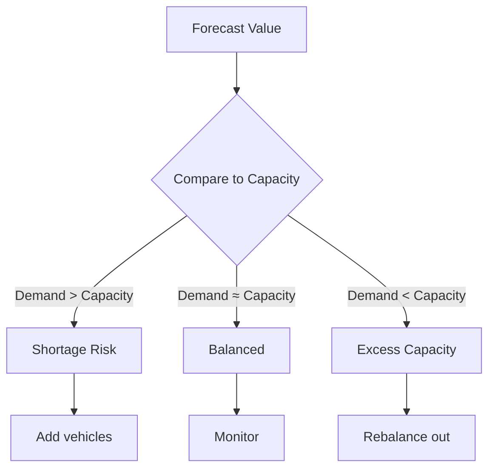
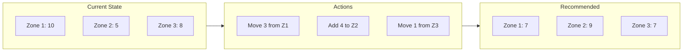
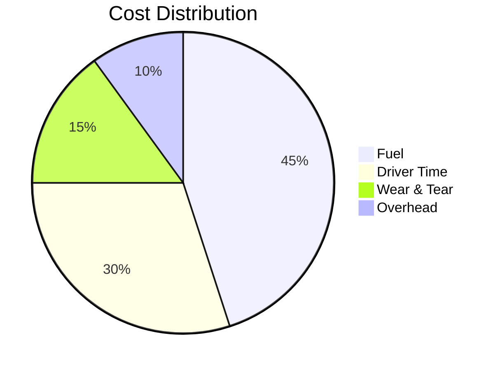

# Understanding Results

Learn how to interpret and act on platform outputs.

## Overview

The platform produces several types of outputs:

- **Forecasts** - Predicted demand by location and time
- **Allocation Plans** - Vehicle assignment recommendations
- **KPIs** - Key performance indicators
- **Explanations** - Decision transparency (Phase 2+)

## Forecast Results

### Output Structure

```python
{
    "1": [15, 18, 22, 25, 28, 24, 20, ...],  # Location 1: hourly demand
    "2": [10, 12, 14, 16, 18, 15, 12, ...],  # Location 2: hourly demand
    "3": [8, 9, 11, 13, 15, 12, 10, ...],    # Location 3: hourly demand
}
```

### Interpreting Forecasts



### Metrics

| Metric | Description | Formula |
|--------|-------------|---------|
| Peak Demand | Maximum hourly demand | `max(forecast)` |
| Average Demand | Mean hourly demand | `mean(forecast)` |
| Demand Variance | Demand variability | `std(forecast)` |
| Peak Hour | Hour with highest demand | `argmax(forecast)` |

## Allocation Results

### Allocation Plan

```python
pd.DataFrame({
    "vehicle_id": ["V001", "V002", "V003", "V004"],
    "source_location": [1, 1, 2, 3],
    "target_location": [2, 1, 3, 1],
    "cost": [15.5, 0.0, 22.3, 18.7],
    "assignment": ["rebalance", "stay", "rebalance", "rebalance"]
})
```

### Assignment Types

| Type | Description | Count Expected |
|------|-------------|----------------|
| `stay` | Vehicle remains at current location | Most vehicles |
| `rebalance` | Vehicle moves to different location | Minority |
| `maintenance` | Vehicle scheduled for service | Few |
| `reserve` | Vehicle held as backup | Optional |

### Interpreting Assignments



## Key Performance Indicators

### Primary KPIs

| KPI | Description | Target | Formula |
|-----|-------------|--------|---------|
| Total Cost | Rebalancing cost | Minimize | Sum of all movement costs |
| Demand Coverage | % demand served | > 95% | Served / Total demand |
| Utilization | Fleet usage rate | 70-85% | Used / Available |
| Service Level | On-time service | > 90% | Timely / Total requests |

### Secondary KPIs

| KPI | Description | Target |
|-----|-------------|--------|
| Rebalancing Moves | Number of vehicle movements | Minimize |
| Empty Miles | Distance without passengers | Minimize |
| Wait Time | Average customer wait | < 10 min |
| Vehicle Idle Time | Time vehicles sit unused | < 30% |

### KPI Dashboard

```
┌─────────────────────────────────────────────────────┐
│                    Daily KPIs                        │
├──────────────────┬──────────────────────────────────┤
│ Total Cost       │ $2,450 (↓ 12% vs yesterday)      │
│ Demand Coverage  │ 96.5% (✓ above target)           │
│ Utilization      │ 78% (✓ within range)             │
│ Vehicles Moved   │ 12 (↓ from 18 yesterday)         │
└──────────────────┴──────────────────────────────────┘
```

## Result Visualization

### Demand vs Capacity

```
Demand Coverage by Location
━━━━━━━━━━━━━━━━━━━━━━━━━━━━━
Zone 1  ████████████████░░░░  82%
Zone 2  ██████████████████░░  92%
Zone 3  ████████████████████  100%
Zone 4  ███████████████████░  98%
Zone 5  █████████████░░░░░░░  68%  ⚠️
```

### Cost Breakdown



## Explainability (Phase 2+)

### Feature Importance

```
Top Features for Demand Forecast
━━━━━━━━━━━━━━━━━━━━━━━━━━━━━━━
hour_of_day     ████████████████████  35%
day_of_week     ██████████████░░░░░░  25%
lag_24h         ████████████░░░░░░░░  20%
month           ████████░░░░░░░░░░░░  12%
is_weekend      ████░░░░░░░░░░░░░░░░   8%
```

### SHAP Values

Explain individual predictions:

```python
# Why is demand high for Zone 2 at 8am?
explanation = explainer.explain(prediction)
print(explanation)
# - hour=8 increases demand by +5.2
# - day=Monday increases demand by +3.1
# - lag_24h=high increases demand by +2.8
```

## Taking Action

### Decision Matrix

| Scenario | Recommended Action |
|----------|-------------------|
| High demand, low supply | Rebalance vehicles IN |
| Low demand, high supply | Rebalance vehicles OUT |
| High risk vehicle | Schedule maintenance |
| Constraint violation | Review constraints |
| Cost spike | Investigate anomalies |

### Automation

```python
# Automated decision workflow
if result.kpis['demand_coverage'] < 0.90:
    alert("Low demand coverage - review allocation")

if result.total_cost > budget_threshold:
    alert("Cost exceeds budget - optimize constraints")

for vehicle in high_risk_vehicles:
    schedule_maintenance(vehicle)
```

## Export Options

### Available Formats

| Format | Use Case |
|--------|----------|
| JSON | API integration |
| CSV | Spreadsheet analysis |
| Parquet | Data warehouse |
| PDF | Stakeholder reports |

### Export Example

```python
# Export to various formats
result.to_json("outputs/allocation_plan.json")
result.to_csv("outputs/allocation_plan.csv")
result.to_parquet("outputs/allocation_plan.parquet")
```

## Next Steps

- [Forecasting Guide](forecasting.md) - Improve forecast accuracy
- [Optimization Guide](optimization.md) - Tune optimization
- [API Reference](../api/index.md) - Programmatic access
