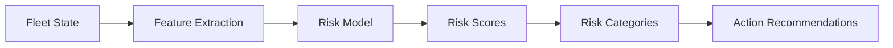
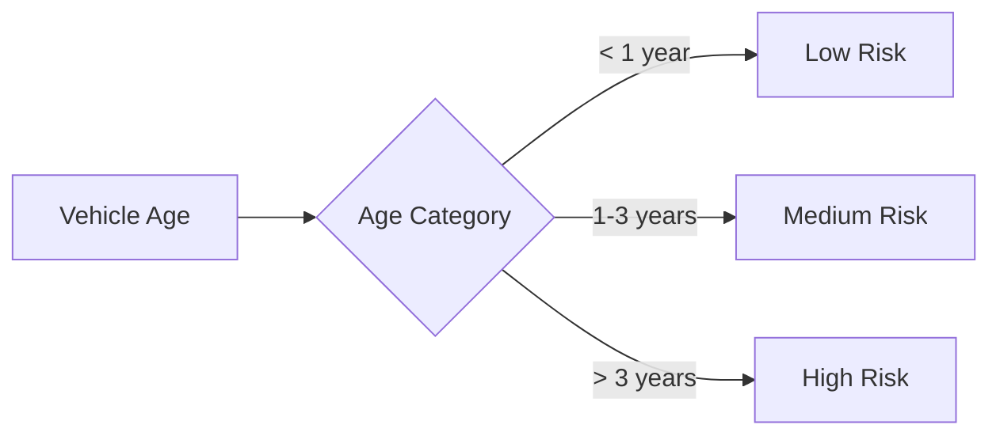
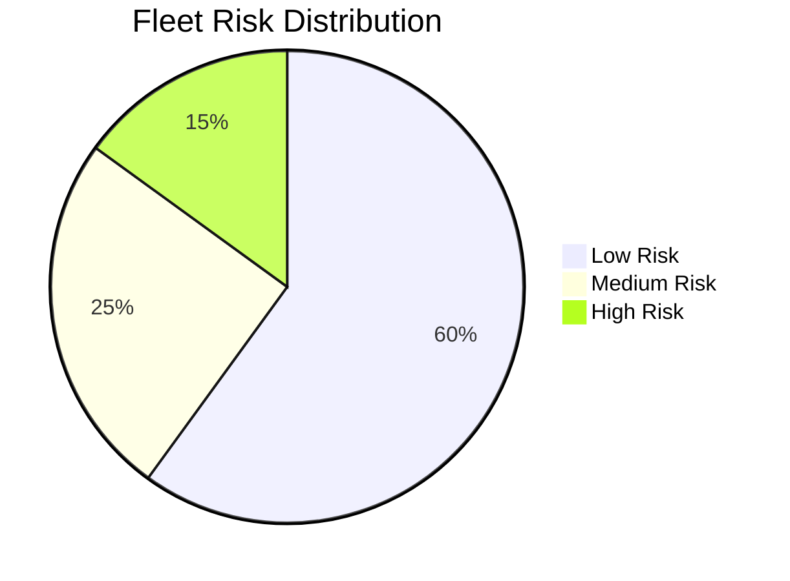

# Risk Assessment

Identify and manage risk across your vehicle fleet.

## Overview

The risk module assesses:

- **Asset failure probability** - Likelihood of vehicle breakdown
- **Contract violation risk** - Risk of exceeding operational limits
- **Remaining useful life** - Time until maintenance required

## Risk Scoring Methods

| Method | Description | Phase |
|--------|-------------|-------|
| Heuristic | Rule-based scoring | MVP |
| Classification | ML-based prediction | Phase 2 |
| Survival Analysis | Time-to-failure estimation | Phase 4 |

## How It Works



## Usage

### Via Python

```python
from src.risk import RiskScorer
from src.utils.config import load_config

# Load configuration
config = load_config()

# Initialize scorer
scorer = RiskScorer(config)

# Calculate risk scores
risk_scores = scorer.calculate(fleet_state)

# Review results
print(risk_scores.head())
#    vehicle_id  risk_score risk_category
# 0        V001        0.15           low
# 1        V002        0.72          high
# 2        V003        0.45        medium
```

### Heuristic Scoring (MVP)

The heuristic scorer uses weighted factors:

```python
risk_score = (
    age_weight * normalized_age +
    utilization_weight * utilization_rate +
    maintenance_weight * days_since_maintenance
)
```

Configuration:

```yaml
risk:
  model: "heuristic"

  heuristic_weights:
    age: 0.3
    utilization: 0.4
    maintenance_history: 0.3

  thresholds:
    high: 0.7
    medium: 0.4
    low: 0.0
```

## Risk Factors

### Vehicle Age



### Utilization Rate

| Utilization | Risk Impact |
|-------------|-------------|
| < 50% | Low - underused |
| 50-80% | Normal |
| > 80% | High - overused |

### Maintenance History

| Days Since Maintenance | Risk Level |
|-----------------------|------------|
| < 7 days | Low |
| 7-21 days | Medium |
| > 21 days | High |

## Output Format

### Risk Scores DataFrame

```python
pd.DataFrame({
    "vehicle_id": ["V001", "V002", "V003"],
    "risk_score": [0.15, 0.72, 0.45],
    "risk_category": ["low", "high", "medium"],
    "age_days": [180, 900, 450],
    "utilization_rate": [0.65, 0.92, 0.78],
    "days_since_maintenance": [5, 28, 14]
})
```

### Risk Distribution



## Integration with Optimization

Risk scores can be integrated into optimization:

```python
# Add risk penalties to optimization
optimizer = CascadingOptimizer(config)

result = optimizer.optimize(
    demand_forecast=forecasts,
    fleet_state=fleet_state,
    network_costs=network_costs,
    constraints=constraints,
    risk_scores=risk_scores  # Include risk
)
```

Risk integration options:

1. **Soft constraint:** Penalize high-risk vehicle usage
2. **Hard constraint:** Exclude high-risk vehicles
3. **Cost adjustment:** Increase cost for risky assignments

## Recommended Actions

| Risk Level | Action |
|------------|--------|
| **High** | Schedule immediate maintenance |
| **Medium** | Monitor closely, plan maintenance |
| **Low** | Normal operation |

## Monitoring Dashboard

Track risk metrics over time:

| Metric | Description | Target |
|--------|-------------|--------|
| Avg Risk Score | Fleet average | < 0.4 |
| High Risk % | Vehicles at high risk | < 10% |
| Risk Trend | Score change over time | Decreasing |

## Best Practices

!!! tip "Regular Assessment"

    - Run risk scoring daily
    - Update fleet state in real-time
    - Track risk trends over time

!!! tip "Threshold Tuning"

    - Start with default thresholds
    - Adjust based on maintenance data
    - Validate against actual failures

!!! warning "Data Quality"

    - Ensure accurate vehicle age data
    - Track actual utilization
    - Record all maintenance events

## Next Steps

- [Optimization Guide](optimization.md) - Use risk in optimization
- [Results Guide](results.md) - Interpret risk outputs
- [API Reference](../api/endpoints.md) - Risk endpoint details
