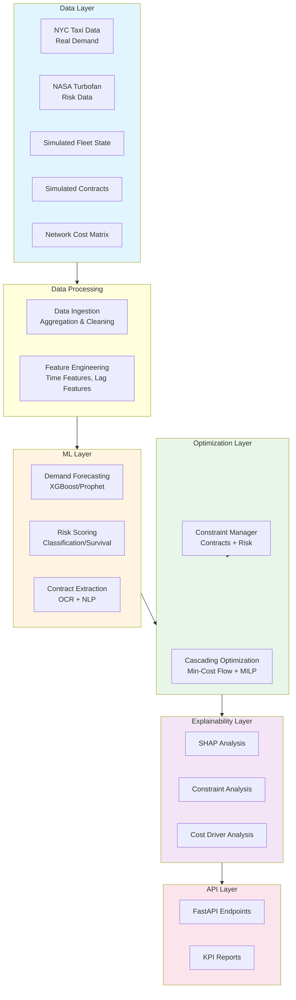
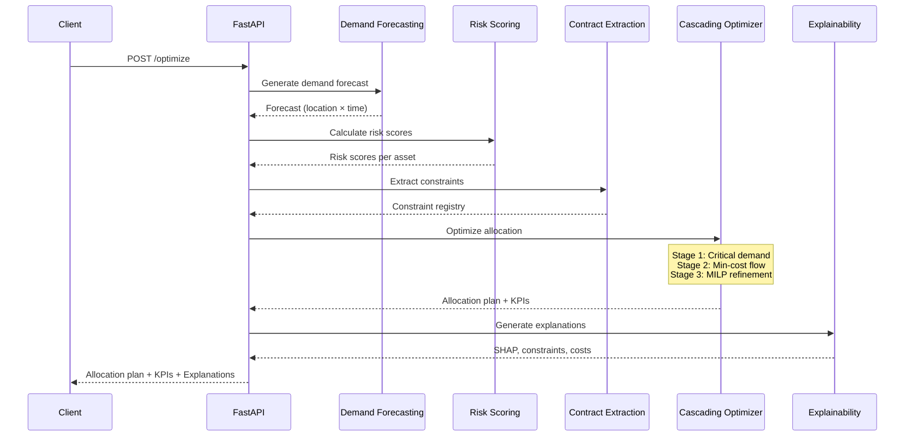
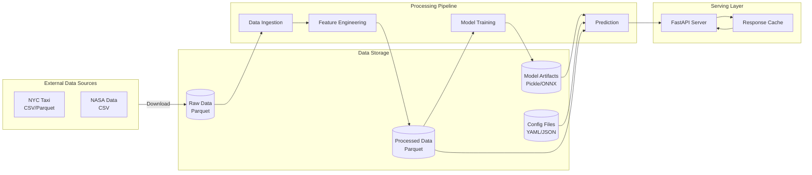
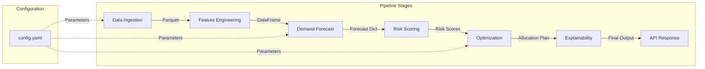

# Fleet Decision Platform
Demand Forecasting · Cascading Optimization · Contract Intelligence · Risk-Aware Planning

---

## Project Objective

Design and implement an end-to-end, enterprise-style decision intelligence platform for fleet operations.
The system forecasts future demand across multiple locations, extracts operational constraints from unstructured contracts, predicts asset risk and out-of-spec behavior, and generates explainable, cost-optimized allocation decisions under real-world constraints.

This project mirrors real fleet optimization platforms used in logistics, transportation, field services, and large-scale asset operations.

---

## Core Capabilities

### 1. Demand Forecasting
- Multi-location time-series forecasting
- Models:
  - XGBoost (baseline, tabular time features)
  - Prophet / BSTS (trend + seasonality)
  - Temporal Fusion Transformer (optional deep model)
- Hierarchical reconciliation:
  - Location → Region → Global
- Outputs:
  - Forecasted demand per location and horizon
  - Prediction intervals for uncertainty awareness

---

### 2. Cascading Optimization
- Multi-stage (“cascading”) decision-making:
  1. Satisfy critical demand and service-level constraints
  2. Min-cost flow rebalancing across locations
  3. MILP refinement for discrete, contractual, and risk constraints
- Optimization techniques:
  - Min-Cost Flow
  - Mixed-Integer Linear Programming (MILP)
- Outputs:
  - Fleet allocation / rebalancing plan
  - Cost, service-level, and constraint KPIs

---

### 3. Contract Intelligence (NLP / Vision)
- Ingest unstructured contract PDFs
- OCR + layout-aware extraction
- Extract and normalize constraints such as:
  - Mileage caps
  - Service-level agreements (SLAs)
  - Penalties and limits
- Optional semantic search over contracts (RAG-style)
- Outputs:
  - Machine-readable constraint registry
  - Evidence spans for explainability

---

### 4. Out-of-Spec & Survival Prediction
- Predict probability of:
  - Contract violations
  - Operational out-of-spec events
  - Asset failure
- Techniques:
  - Classification / regression
  - Survival analysis (time-to-failure estimation)
- Outputs:
  - Risk scores per asset
  - Remaining useful life estimates
- Integrated directly into optimization as penalties or constraints

---

### 5. Explainability & Business Impact
- Explainability at every stage:
  - SHAP for demand forecasts
  - Feature attribution for risk models
  - Binding-constraint and cost-driver analysis for optimization
- Business KPIs:
  - Total operational cost
  - Service-level compliance
  - Contract violations avoided
  - Risk exposure reduction
  - Asset utilization

---

## Data Sources

### Blending Strategy: Real-World + Simulated Data

**Approach**: Real demand patterns drive optimization decisions, while simulated fleet state provides operational context. This allows realistic testing without proprietary enterprise data.

---

### Real-World Data Sources

#### 1. Demand Data (Real)
- **Primary Source**: NYC Taxi & Limousine Commission (TLC) trip data
- **Usage**: Aggregated by location (taxi zones/boroughs) and time as proxy for fleet service demand
- **Time Alignment**: Same period approach (e.g., 2023 taxi data → 2023 simulated fleet operations)
- **Processing**: Aggregate trips by pickup/dropoff zones, hourly/daily time buckets
- **Geographic Scope**: NYC taxi zones as fleet locations (can be mapped to other geographies if needed)

#### 2. Risk / Degradation Data (Real)
- **Primary Sources**:
  - NASA Turbofan Engine Degradation Simulation Dataset
  - UCI Machine Learning Repository predictive maintenance datasets
- **Usage**: Mapped conceptually to fleet assets for survival analysis and out-of-spec prediction
- **Application**: Predict asset failure probability, remaining useful life, contract violation risk

---

### Simulated Data Sources

#### 1. Fleet Inventory & State (Simulated)
- Vehicle counts per location (initial distribution)
- Availability states (operational, maintenance, downtime)
- Capacity constraints per vehicle type
- Real-time fleet state tracking

#### 2. Network Costs (Simulated)
- Zone-to-zone distance matrices (derived from geographic coordinates)
- Travel-time matrices (can incorporate real traffic patterns if available)
- Used as edge costs in min-cost flow optimization
- Configurable cost models (distance-based, time-based, fuel-based)

#### 3. Contracts (Simulated)
- Synthetic fleet contracts with realistic constraint types:
  - Mileage caps per vehicle/location
  - Service-level agreements (SLAs) - response time, availability %
  - Penalties and limits (financial penalties for violations)
  - Maintenance requirements
- Generated with configurable templates for controlled experiments
- Can be extended with real public procurement contracts later

#### 4. Maintenance Cycles (Simulated)
- Asset lifecycle patterns
- Scheduled maintenance windows
- Downtime distributions
- Maintenance cost models

#### 5. All Operational Fleet State (Simulated)
- Capacity utilization tracking
- Operational status (active, idle, in-transit, maintenance)
- Historical utilization patterns
- Fleet expansion/contraction scenarios

---

### Data Integration Points

- **Demand → Optimization**: Real demand forecasts drive rebalancing decisions
- **Fleet State → Optimization**: Simulated inventory/availability constrains decisions
- **Risk → Optimization**: Real risk patterns inform asset failure predictions, integrated as penalties/constraints
- **Contracts → Optimization**: Simulated contracts provide constraint extraction targets and operational limits
- **Network Costs → Optimization**: Simulated cost matrices enable min-cost flow calculations

---

## System Architecture

### High-Level Architecture Diagram



### Component Interaction Flow



### Data Flow Architecture



---

## Repository Structure

### Proposed Directory Layout

```
fleet-cascade/
├── README.md
├── pyproject.toml              # Package management with uv
├── setup.py                    # Optional: package installation
├── .env.example                # Environment variables template
├── .env.example                # Environment variables template
├── .gitignore
├── .cursorrules                # Cursor AI coding guidelines and patterns
│
├── config/                     # Configuration files
│   ├── config.yaml             # Main configuration
│   ├── mvp_config.yaml         # MVP-specific config
│   └── constraints/            # Constraint definitions (MVP)
│       └── fleet_constraints.json
│
├── data/                       # Data directory (gitignored in production)
│   ├── raw/                    # Raw data files
│   │   ├── nyc_taxi/          # NYC Taxi data
│   │   ├── nasa_turbofan/     # NASA risk data
│   │   └── contracts/         # Contract PDFs (if any)
│   ├── processed/             # Processed/cleaned data
│   │   ├── demand/            # Aggregated demand data
│   │   ├── fleet_state/       # Simulated fleet state
│   │   └── network/           # Network cost matrices
│   ├── models/                # Trained model artifacts
│   │   ├── demand_forecast/
│   │   ├── risk_scoring/
│   │   └── contract_extraction/
│   └── outputs/               # Generated outputs
│       ├── forecasts/
│       ├── allocations/
│       └── reports/
│
├── src/                        # Source code
│   ├── __init__.py
│   │
│   ├── data/                   # Data processing modules
│   │   ├── __init__.py
│   │   ├── ingestion.py       # Data ingestion from sources
│   │   ├── preprocessing.py   # Data cleaning and transformation
│   │   ├── feature_engineering.py
│   │   └── simulation.py      # Fleet state simulation
│   │
│   ├── forecasting/           # Demand forecasting
│   │   ├── __init__.py
│   │   ├── models/            # Model implementations
│   │   │   ├── __init__.py
│   │   │   ├── xgboost_model.py
│   │   │   ├── prophet_model.py
│   │   │   └── tft_model.py   # Temporal Fusion Transformer
│   │   ├── trainer.py         # Model training logic
│   │   ├── predictor.py       # Prediction interface
│   │   └── hierarchy.py       # Hierarchical reconciliation
│   │
│   ├── risk/                   # Risk and survival prediction
│   │   ├── __init__.py
│   │   ├── scoring.py         # Risk scoring (heuristics + ML)
│   │   ├── survival.py        # Survival analysis
│   │   └── models/            # Risk model implementations
│   │       ├── __init__.py
│   │       └── classifier.py
│   │
│   ├── contracts/              # Contract intelligence
│   │   ├── __init__.py
│   │   ├── extraction.py      # OCR + NLP extraction
│   │   ├── parser.py          # PDF parsing
│   │   ├── registry.py        # Constraint registry
│   │   └── search.py          # RAG-style search (Phase 3+)
│   │
│   ├── optimization/           # Optimization engine
│   │   ├── __init__.py
│   │   ├── cascade.py         # Cascading optimization orchestrator
│   │   ├── min_cost_flow.py   # Min-cost flow solver
│   │   ├── milp.py            # MILP refinement
│   │   ├── constraints.py     # Constraint management
│   │   └── solvers/           # Solver wrappers
│   │       ├── __init__.py
│   │       ├── ortools_wrapper.py
│   │       └── pulp_wrapper.py
│   │
│   ├── explainability/         # Explainability modules
│   │   ├── __init__.py
│   │   ├── shap_analysis.py   # SHAP for forecasts
│   │   ├── constraint_analysis.py
│   │   └── cost_analysis.py   # Cost driver analysis
│   │
│   ├── api/                    # FastAPI application
│   │   ├── __init__.py
│   │   ├── main.py            # FastAPI app entry point
│   │   ├── routes/            # API routes
│   │   │   ├── __init__.py
│   │   │   ├── optimize.py   # Main optimization endpoint
│   │   │   ├── forecast.py   # Forecast endpoint
│   │   │   └── explain.py    # Explainability endpoint
│   │   ├── models/            # Pydantic models for API
│   │   │   ├── __init__.py
│   │   │   ├── requests.py
│   │   │   └── responses.py
│   │   └── utils.py           # API utilities
│   │
│   └── utils/                  # Shared utilities
│       ├── __init__.py
│       ├── config.py          # Configuration loader
│       ├── logging.py         # Logging setup
│       └── metrics.py         # KPI calculation
│
├── notebooks/                   # Jupyter notebooks (optional)
│   ├── exploration/           # Data exploration
│   ├── experiments/          # Model experiments
│   └── demos/                 # Demo notebooks
│
├── tests/                       # Tests
│   ├── __init__.py
│   ├── unit/                  # Unit tests
│   │   ├── test_forecasting.py
│   │   ├── test_optimization.py
│   │   └── ...
│   ├── integration/           # Integration tests
│   │   └── test_pipeline.py
│   └── fixtures/              # Test fixtures/data
│
├── scripts/                     # Utility scripts
│   ├── download_data.py       # Download NYC/NASA data
│   ├── generate_fleet.py      # Generate simulated fleet
│   ├── train_models.py        # Train all models
│   └── run_pipeline.py        # Run end-to-end pipeline
│
├── docs/                        # Documentation
│   ├── architecture.md
│   ├── api_documentation.md
│   └── deployment.md
│
└── docker/                      # Docker files (Phase 4)
    ├── Dockerfile
    └── docker-compose.yml
```

### Module Organization Principles

1. **Separation of Concerns**: Each major capability (forecasting, optimization, risk, contracts) is in its own module
2. **Config-Driven**: All parameters in YAML/JSON configs, not hardcoded
3. **Modular Models**: Model implementations are swappable (e.g., XGBoost vs Prophet)
4. **API-First**: FastAPI layer is separate, can be extended to dashboard later
5. **Testable**: Clear interfaces between modules enable unit and integration testing
6. **MLOps-Ready**: Model artifacts stored separately, versioning-ready structure

### MVP Simplification

For MVP, start with flatter structure:
- `src/` can be single module initially
- Skip `notebooks/` and `docs/` initially
- Minimal `tests/` (integration test only)
- Single `config.yaml` instead of multiple configs

Refactor to full structure as complexity grows.

---

## Technical Architecture Decisions

### Module Communication Pattern

**Approach**: Pipeline-based with clear interfaces



**Data Formats Between Modules**:
- **Raw Data**: Parquet files (efficient, columnar)
- **Processed Data**: Pandas DataFrames in memory, Parquet for persistence
- **Model Inputs/Outputs**:
  - Forecasts: `Dict[str, np.ndarray]` (location → forecast array)
  - Risk scores: `pd.DataFrame` with asset_id, risk_score columns
  - Allocation plan: `pd.DataFrame` with vehicle_id, location, assignment
- **API**: JSON (Pydantic models for validation)

### Configuration Management

**Structure**: Hierarchical YAML config with environment overrides

```yaml
# config/config.yaml
data:
  nyc_taxi:
    path: "data/raw/nyc_taxi"
    zones: [1, 2, 3, 4, 5]
    time_range: "2023-01-01:2023-03-31"

  fleet:
    num_vehicles: 50
    locations: 5
    simulation_seed: 42

forecasting:
  model: "xgboost"  # or "prophet", "tft"
  horizon_days: 7
  features:
    - hour
    - day_of_week
    - month

optimization:
  solver: "ortools"  # or "pulp"
  stages:
    - critical_demand
    - min_cost_flow
  constraints:
    max_distance: 100
    capacity_per_vehicle: 1
```

### Error Handling & Logging

- **Logging**: Python `logging` module with structured logs (JSON format for production)
- **Error Handling**: Custom exceptions per module (e.g., `ForecastError`, `OptimizationError`)
- **Validation**: Pydantic models for API inputs, assertions for internal data

### Model Versioning (Future)

- Store model artifacts with metadata (timestamp, hyperparameters, performance)
- Use MLflow or simple JSON metadata files
- Enable model rollback and A/B testing

### Dependency Management

- **Core**: Python 3.9+
- **Package Manager**: `uv` (modern, fast Python package manager)
- **Project File**: `pyproject.toml` (single source of truth for dependencies)
- **Virtual Environment**: Managed automatically by `uv` (no manual venv needed)
- **Key Dependencies**:
  - `pandas`, `numpy` - Data processing
  - `xgboost` - Demand forecasting
  - `ortools` or `pulp` - Optimization
  - `fastapi`, `uvicorn` - API
  - `pydantic` - Data validation
  - `pyyaml` - Config parsing
  - `shap` - Explainability (Phase 2+)

---

## Key Outputs

- Demand forecast table (location × horizon)
- Optimized fleet allocation plan
- Risk and survival estimates per asset
- Contract constraint registry with evidence
- Business KPI and explainability reports

---

## Suggested Tech Stack

- Programming: Python
- ML: XGBoost, PyTorch
- Optimization: OR-Tools / PuLP
- NLP / Vision: OCR + layout-aware transformers
- Serving: FastAPI
- Containerization: Docker
- Explainability: SHAP
- Storage: Parquet / local object storage (data processing)
- Databases: PostgreSQL (primary), Redis (caching), Pinecone (vector storage)
- Database CLI: psql for PostgreSQL operations
- Cloud: AWS (AWS CLI for operations), S3, SageMaker, ECS, RDS
- Documentation: MkDocs for project documentation
- Design: modular, config-driven, MLOps-ready

---

## Minimal Viable Product (MVP) / Phased Approach

To keep the initial implementation minimal and focused, consider the following phased approach:

### Phase 1: Core Pipeline (MVP)
**Goal**: Demonstrate end-to-end flow with minimal complexity

**Simplifications**:
- **Demand Forecasting**: Start with single model (XGBoost only), skip hierarchical reconciliation initially
  - Single location or 3-5 locations max
  - Simple time features (hour, day, week, month)
  - Point forecasts only (skip prediction intervals initially)
- **Optimization**: Single-stage min-cost flow only
  - Skip cascading complexity
  - Basic constraints: capacity, demand satisfaction
  - Skip MILP refinement initially
- **Contract Intelligence**: Skip entirely in MVP
  - Use hardcoded constraint config files (JSON/YAML)
  - Add contract extraction in Phase 2
- **Risk Prediction**: Simplified version
  - Basic risk scores (e.g., binary: high/low risk)
  - Skip survival analysis initially
  - Use simple heuristics (age, utilization) instead of ML models
- **Explainability**: Minimal
  - Basic feature importance for demand model
  - Skip SHAP initially
  - Simple cost breakdown in optimization output
- **API**: Basic FastAPI endpoint
  - Single endpoint: `/optimize` (input: demand forecast, output: allocation plan)
  - Skip dashboard initially
  - Return JSON only

**MVP Data Requirements**:
- NYC Taxi data: 1-3 months, 3-5 zones
- Simulated fleet: 20-50 vehicles, 3-5 locations
- Simple network: Euclidean distance or Manhattan distance
- Hardcoded constraints: 2-3 constraint types (capacity, max distance)

**MVP Outputs**:
- Demand forecast (location × time)
- Allocation plan (vehicles × locations)
- Basic KPIs: total cost, demand coverage %

---

### Phase 2: Enhanced ML & Optimization
**Additions**:
- Hierarchical demand forecasting (Location → Region)
- Prophet/BSTS for seasonality
- Cascading optimization (2-stage: critical demand → min-cost flow)
- Basic risk ML model (classification)
- SHAP explainability for forecasts

---

### Phase 3: Contract Intelligence
**Additions**:
- OCR + PDF parsing
- Constraint extraction (mileage caps, SLAs)
- Contract registry
- Integration into optimization constraints

---

### Phase 4: Advanced Features
**Additions**:
- MILP refinement stage
- Survival analysis for risk
- Temporal Fusion Transformer (optional)
- Full explainability suite
- Dashboard/visualization
- RAG-style contract search

---

### Additional Minimalism Strategies

**Code Structure**:
- Start with single script/module, refactor to packages later
- Use config files (YAML/JSON) for parameters instead of complex config systems
- Skip Docker initially, add when needed
- Use local Parquet files, skip object storage initially

**Data Processing**:
- Pre-process and cache NYC taxi data (don't download/process on-the-fly)
- Use simple CSV/Parquet, skip complex data pipelines
- Generate simulated data with simple Python scripts (numpy/pandas)

**Testing**:
- Focus on integration tests for end-to-end flow
- Skip unit tests initially, add incrementally
- Use simple assertions, skip complex test frameworks

**Documentation**:
- README with setup instructions
- Docstrings for key functions
- Skip extensive docs initially

---

## Success Criteria

- Demonstrates full ML → optimization → decision pipeline
- Shows explainability for both predictions and decisions
- Produces measurable, business-relevant KPIs
- Reflects real enterprise fleet optimization challenges
- Ready for extension to cloud deployment (AWS/SageMaker-style)

---

## Milestone Checklist

### Phase 1: MVP (Minimal Viable Product)
- [ ] Data ingestion: NYC Taxi data processing (3-5 zones, 1-3 months)
- [ ] Fleet simulation: Generate inventory, network costs, basic constraints
- [ ] Demand forecasting: XGBoost baseline (single model, point forecasts)
- [ ] Optimization: Single-stage min-cost flow (basic constraints)
- [ ] Risk scoring: Simple heuristics (age/utilization-based)
- [ ] Basic API: FastAPI endpoint for optimization pipeline
- [ ] MVP demo: End-to-end workflow with sample data

### Phase 2: Enhanced ML & Optimization
- [ ] Hierarchical demand forecasting (Location → Region)
- [ ] Prophet/BSTS models for seasonality
- [ ] Cascading optimization (2-stage: critical demand → min-cost flow)
- [ ] Risk ML model (classification)
- [ ] SHAP explainability for forecasts
- [ ] Enhanced API with explainability endpoints

### Phase 3: Contract Intelligence
- [ ] OCR + PDF parsing infrastructure
- [ ] Constraint extraction (mileage caps, SLAs, penalties)
- [ ] Contract registry with evidence spans
- [ ] Integration of extracted constraints into optimization
- [ ] Contract search/query capability (optional RAG)

### Phase 4: Advanced Features
- [ ] MILP refinement stage (3-stage cascading)
- [ ] Survival analysis for risk prediction
- [ ] Temporal Fusion Transformer (optional deep model)
- [ ] Full explainability suite (SHAP, constraint analysis, cost drivers)
- [ ] Dashboard/visualization interface
- [ ] Docker containerization
- [ ] Production-ready deployment guide

---

## One-Line Summary

An enterprise-grade decision platform that transforms demand forecasts, contract rules, and risk predictions into explainable, cost-optimized fleet allocation decisions.

---
